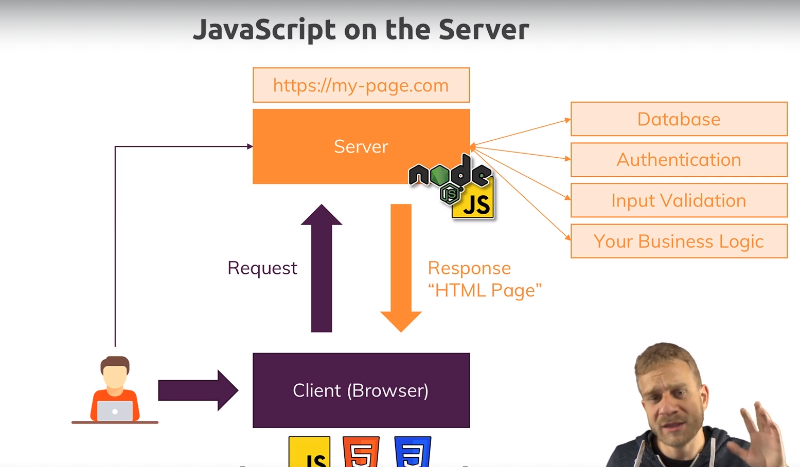

# NodeJs The complete guide (MVC, REST API, GRAPHQL, DENO)

## NodeJs

Runtime JS = JS langage de programmation utilisé dans le navigateur pour manipuler le DOM, la page, qui a été chargée dans le navigateur, permet d'intéragir avec la page après son chargement, et c'est une ^partie cruciale pour créer des interfaces utilisateur intéractives dans le navigateur.  
NodeJs est une version différente de JS, il est essentiellement contruit sur JS, il y ajoute des fonctionnalités.
Il prend JS et le place dans un environnenement différent, il permet d'exécuter du JS côté serveur comme un langage de programmation.

NodeJs utilise v8 qui est le moteur de Js, qui exécute JS dans le navigateur.
Le moteur prend le code JS, qui s'exécute dans le navigateur et le compile en code machine car c'est le code qui s'exécute finalement ur l'ordinateur et peut être géré efficacement.

On peut par exemple, travailler avec le système de fichiers local, ... NodeJs ne s'exécute pas dans le navigateur.
Permet donc d'exécuter JS sur l'ordinateur et ajoute des fonctionnalités utiles au moteur JS afin d'y faire plus de choses.

### Installer NodeJs et créer la première application

Install NodeJs
PS C:\Users\utilisateur\Desktop\GIT\NodeJS_appli_paiement> node -v
v18.14.2

cmd node (mode intéractif)
nouveau mode terminal
(calculatrice, exé JS)

Nouveau projet:
play.js

    // console.log("Hello from NodeJs");
    // (node play.js)

        // récupération fonctionnalité syst de fichiers pour travailler avec le syst de fichiers. Info Node import de cette fonctionnalités. Modul fs module principal du noeud
    const fs = require("fs");

    // appel syst de fichiers pour appeler la bonne sync de fichiers, méthode rendue possible par l'objet importé
    // Cette méthode va écrire un fichier sur le disque dur. En argument le chemin d'accès au fichier , y compris nom du fichier et le 2ème arg contenu du fichier (écrire dans un fichier via le module )
    fs.writeFileSync("hello.txt", "Hello from NodeJs again");
    node play.js
    ajout fichier txt 

### Rôle et usage de NodeJS

Pour exécuter sur un serveur pour écrire du code côté serveur.

Ecrire code sur le serveur qui renvoie des données avec lesquelles les user peuvent travailler.

C'est aussi un runtime JS: exécuter JS sans navigateur, peut être utilisé pour les scripts d'utilitaires locaux ou outils de gnération.
(REACT, Angular, ... processus de construction nécessaire à ces langages ou frameworks car excellent outil pour écrire des scripts).

On écrit pas seulement le code qui s'exécute sur le serveur, on écrit le serveur.
Exécuter la logique métier, donc pas seulement pour écouter les requêtes entrantes mais ensuite travailler avec des fichiers, travailler avec des BDD,...
Gestion des réponses, pas que pour les demandes entrantes, pour renvoyer des données au clientcome des pages HTML, données au format JSON, dossiers,...

### REPL

Exécution du code de NodeJs.
Lecture, lecture de l'entrée user, Evaluation de l'entrée user, Print sortie d'un résultat Loop boucle pour retourner et atttendre une nouvelle entrée REPL.
Avec node en commande => nous sommes dans le REPL (pas de chemin complet de l'ordinateur).
C'est un environnement où ne stockons pas notre code dans des fichiers mais nous écrivons notre application de node à chaque ligne.
"C'est un terrain de jeu".
L'alternative est d'exécuter des fichiers.

## Rapide rappel de JS

### JS en bref

- Langage de programmation faiblement typé, 
- programmation orienté objet, 
- polyvalent,
- pas d'affectation (assignement) de type explicite,
- les données d'un type peuvent être modifiées en un autre de manière dynamique, 
- flexible,
- les données peuvent être organisées en objets logiques,
- différence entre types primiitifs et types de références (voir vidéo),
- peut être exécuté hors du navigateur, configuré sur un serveur.

### Core syntaxe

play.js

    // var aso = "aso";
    // console.log(aso);

    // var age = 29;
    // var hobbie = true;
    // console.log(age, hobbie);
    // :var globales

    function summerUser(userName, userAge) {
    return `Name is ${userName} age is ${userAge}`;
    }
    // userName... utilisable seulement dans la fonction, scopes
    // appel de fonction avec arg

    console.log(summerUser(aso, age));

### let et const

var syntaxe obsolète => **let** la portée se comporte différemment.

valeur de la variable ne change jamais => **const**.

### Fonction fléchée

    const summerUser = function (userName, userAge) {
    // fonction à droite du égal: fonction anonymemais de façon implicite l'est en la stockant dans la const
    return `Name is ${userName} age is ${userAge}`;
    };s
    console.log(summerUser(aso, age));

    const summerUser = (userName, userAge) => {
        // retarit motclef function
    return `Name is ${userName} age is ${userAge}`;
    };

    console.log(summerUser(aso, age));
    => voir mot clef this

    const summerUser = (a, b) => return a + b;
    => si une seule instruction

    const summerUser = a => a= 1;
    => sans parenthèse si un seul paramètre

    const addRandom = () => 1 + 2;

### Objets, propriétés et méthodes

    // const person = {
    //   nom: "aso",
    //   prenom: "paul",
    //   // propriété ou fiel (champ)
    //   greet: () => {
    //     console.log(`hi ${this.nom}`);
    //   },
    // };

    //  objet js avec paire clé valeur, peut contenir des fonctions, var,
    // console.log(person, person.greet());
    // { nom: 'aso', prenom: 'paul' }
    // { nom: 'aso', prenom: 'paul', greet: [Function: greet] }
    // { nom: 'aso', prenom: 'paul', greet: [Function: greet] } undefined car this fait réf à la portée globale non à l'objet, il faut donc faire une fonction classique.

    const person = {
    nom: "aso",
    prenom: "paul",
    // propriété ou field (champ)
    greet() {
        console.log(`hi ${this.nom}`);
    },
    };
    console.log(person);
    person.greet();
    // hi aso

### Array

Tableaux:

    const aso = ["sport", "hello"];
    const asso = ["sport", "hello", 1, true, {}];

    for (let test of aso) {
    console.log(test);
    }
    // sport
    // hello
    // deux exécutions

    // transf tableaux, valeurs sans modifier l'ancien tableau mais en donnant un nouveau. Map prend une fonction indiquant comment éditer les éléments du tableau. Elle sera exécutée sur chaque élements du tableau, l'un après l'autre
    console.log(aso.map((as) => `hey ${as}`));
    console.log(aso);
    // [ 'hey sport', 'hey hello' ]
    // [ 'sport', 'hello' ]

### Arrays, objets et types de références

**Objets et tableaux sont des types de référence**.
Quand je stocke, par exemple, un tableau dans une constante, je peux modifier les valeurs sans violer la restriction des constantes qui ne doivent pas changer.

    aso.push("chocolat");
    // méthode push ajout d'un nouvel élément au tableau
    console.log(aso);
    => [ 'sport', 'hello', 'chocolat' ]

**Le fait de modifier la constante n'envoie pas d'erreur car les types de référence stockent uniquement une adresse pointant vers l'endroit en mémoire où ce tableau est stocké, et que l'adresse du pointeur n'a pas été modifiée par l'ajout d'un nouvel élément.**
La valeur de la cosntante, n'a pas conséquent pas changée, c'est ce sur quoi cela pointe que s'effectue le changement. Nous n'éditons pas vraiment ce qui est stockée dans une constante, nous éditons uniquement la chose vers laquelle elle pointe.

### Spread et Rest Operators

Deux opérateurs importants en JS:

disons que nous voulons implémenter le modèle où lorsque nous ajoutons un nouvel élément dans le tableau, nous ne modifions pas le tableau d'origine, mais créons un nouveau tableau avec les anciennes valeurs et la nouvelle = **immutabilité**, où nous n'avons jamais ajouté de valeurs existantes, mais où nous les remplaçons par des copies plus les modifications.
Pas de mofification de l'objet existant.
Il existe plusieurs méthodes.

    // const copieAso = aso.slice();
    // // slice opérator, l'on peut y placer des args
    // console.log(copieAso);
    // // copie du tableau

    // l'on peut passer des args
    const copieAso = [aso];
    console.log(copieAso);
    // [ [ 'sport', 'hello' ] ] array d'un array , le tableau externe n'a qu'un seul élément le tableau interne, ça n'est pas une copie mais un nouveau tableau où le premier élément est l'ancien tableau. Pas une copie, le même objet = tableau imbriqué

**spread opérator** sont des points libres ajoutés devant un tableau ou un objet: ...
ils prennent le tableau ou l'objet après l'opérateur et extraient tous les éléments d'un tableau ou propriétés d'un objet.

    const aso = ["sport", "hello"];
    const asso = ["sport", "hello", 1, true, {}];

    // const copieAso = aso.slice();
    // // slice opérator, l'on peut y placer des args
    // console.log(copieAso);
    // // copie du tableau

    // l'on peut passer des args
    const copieAso = [...aso];
    console.log(copieAso);
    // [ [ 'sport', 'hello' ] ] array d'un array , le tableau externe n'a qu'un seul élément le tableau interne, ça n'est pas une copie mais un nouveau tableau où le premier élément est l'ancien tableau. Pas une copie, le même objet = tableau imbriqué
    // [ 'sport', 'hello' ], copie de l'ancien. Extraction des éléments du tableau imbriqué précédent.

    const person = {
    nom: "aso",
    prenom: 34,
    greet() {
        console.log(`${this.nom}`);
    },
    };
    const copiePerson = { ...person };

    console.log(copiePerson);
    // copie de person { nom: 'aso', prenom: 34, greet: [Function: greet] } ajoutée à un nouvel objet

**Rest opérator**:
contraire du spread opérateur:

    const toArray = (args1, args2, args3) => {
    return [args1, args2, args3];
    };

    console.log(toArray(2, 3, 4));
    // [ 2, 3, 4 ]

    const toArray2 = (...args) => {
    return args;
    };

    console.log(toArray2(2, 3, 4));
    // [ 2, 3, 4 ] retourne un tableau avec les arguments souhaités.
**Fusion de plusieurs arguments**.

### Destructuring

    const person = {
    nom: "aso",
    age: 34,
    greet() {
        console.log(`${this.nom}`);
    },
    };

    // // structuration d'objet
    // const personName = (personData) => {
    //   console.log(personData.nom);
    // };
    // personName(person);
    // // aso

    // destructuring
    const personName2 = ({ nom }) => {
    // args propriété de l'objt entrant qui en sera extrait
    console.log(nom);
    };
    personName2(person);
    // aso

    const { nom, age } = person;
    console.log(nom, age);
    // aso 34
    // création de deux constantes pour nom et age

Peut être effectué sur des objets, tableaux:

        const hobbi = ["sport", "cooking"];
    const [hobbi1, hobbi2] = hobbi;
    console.log(hobbi1, hobbi2);
    // sport cooking
    // l'on peut choisir les noms souhaités dans ce cas car les éléments n'ont pas de nom, juste des positions. Ca sera toujours le premier élément puis deuxième

### Code asynchrone et promesses

Code asynchrone:

    setTimeout(() => {
    console.log("timer is done!");
    }, 2000);
    // attente de 2scds pour exé instruction, code async ne se produit pas immédiatemment. Fonction callback

    console.log("hello");
    console.log("");
    // code sync
    // hello

    // timer is done!

Pour travailler avec du code asynchrone, il a plusieurs techniques de gestion:
- **callback**:

    const fetchData = (callback) => {
    setTimeout(() => {
        callback("Done!");
    }, 1500);
    };

    setTimeout(() => {
    console.log("timer is done!");
    fetchData((text) => {
        console.log(text);
    });
    }, 2000);
    // créa d'une fonction fetchData qui reçoit un appel afin de définir une fonction qui devra s'exécuter une fois que la minuterie interne est effectuée à partir d'un autre endroit
    // appels async imbriqués => promesses à utiliser

    console.log("hello");
    console.log("");
    // hello

    // timer is done!
    // Done!
- **promesses**:
beaucoup utilisées dans les packages par NodeJs, rarement par nous >

   const fetchData = () => {
    const promise = new Promise((resolve, reject) => {
        setTimeout(() => {
        resolve("Done!");
        }, 1500);
    });
    return promise; //code sync
    // nouvel objet basé sur un cosntructeur JS intégré à js avec deux arg qui st des fonctions un pour accomplir la promesse avec succès et l'autre lancer une erreur. Fait auto par les packages
    };

    setTimeout(() => {
    console.log("timer is done!");
    fetchData().then((text) => {
        // callback promesse
        console.log(text);
    });
    }, 2000);
    // créa d'une fonction fetchData qui reçoit un appel afin de définir une fonction qui devra s'exécuter une fois que la minuterie interne est effectuée à partir d'un autre endroit
    // appels async imbriqués => promesses à utiliser

    console.log("hello");
    console.log("");
    // hello

    // timer is done!
    // Done!
- ...

### Littéraux de gabarits ou templates litterals

Sont des littéraux de chaînes de caractères permettant d'intégrer des expressions.
Avec eux, l'on peut utiliser des chaînes de caractères multi-lignes et fonctionnalités d'**interpolation**:

    `txt``ligne de txt1
    ligne de txt 2`
    `txt ${expression}`

## Comprendre les bases

### Comment le web fonctionne

    User/client (Browser)

    Url entry
http://

    domain lookup
browser atteint certains serveurs de noms de domaines, le domaine n'est pas vraiment l'adresse du serveur, c'est une version codée lisible par l'homme de cette adresse .Le serveur n'a qu'une adresse ip.

Le navigateur ou client envoie une requête au serveur avec l'adresse ip, adresse appartenant au nom de domaine.
L'on écrit le code qui s'exécute sur cet ordinateur, sur internet qui a cette adresse ip, code qui fait tourner le serveur capable de gérer la demande entrante et de faire quelque chose avec.
Dans ce code l'on peut faire plein de choses.

Renvoie une réponse au client, page HTML, ensuite gérée par le client, fichier, données JSON,...
Une réponse est plus que le contenu, reponsé et demande ont une en-tête(header) = méta-informations, qui sont atachées à la demande et à la réponse et décrivant ce qui s'y trouve par exemple.

La transmission des demandes et réponses se fait via un **protocole** (méthode de communication standardisée), pour gérer correctement une demande et renvoyer une réponse avec laquelle le navigateur peut fonctionner nous devons respecter certaines règles, et ces règles sont définies par le protocole utilisé, **http** ou **https**.

Http = Hyper Text Transfer Protocol, transfert de données comprises par le navigatuer et serveur.
Il défini à quoi ressemble une demande valide et comment les données doivent, être transférées du navigateur au serveur et vice versa.
Https = le même mais avec le cryptage **SSl** activé où toutes les données transmises sont cryptées.

### Création d'un serveur node

fichier app.js, fichier racine de l'application , fichier d'exécution.

core modules:
http -> lancer serveur, envoie de requête
https
fs
path
os

    const http = require("http");
    // import module http intégré dans NodeJs

    // function rqListener(req, res) {

    // }
    // // écouteru reçoit une demande qui est un message entrant, et renvoie un objet de réponse, que l'on peut utiliser pour renvoyer une réponse à la personne qui a fait cette demande.

    // http.createServer(rqListener);
    // // création serveur. Demande à create de chercher la fonction et l'exécuter pour chaque demande entrante

    http.createServer((req, res) => {
    // fonction callback appelée chaque fois qu'une reuête attteint le serveur
    console.log(req);
    // rien car aucune requête envoyée
    });
    // cette méthode de création renvoie un serveur, doit être stockée dans une var

    const server = http.createServer((req, res) => {
    console.log(req);
    });

    server.listen(8080);
    // écoute de node pour les requêtes entrantes. Prend en args port qui ne sert pas en prod. Toujours actif

### Cycle de vie de node et boucle d'événements

node app. js => start script, parcours du fichier, analyse du code, enregistrement des var ...
=>**event loop**, processus de boucle géré par NodeJs qui continue de fonctionner tant qu'il y a du travail à faire, il continue aussi longtemps qu'il ya des écouteurs d'événements enregistrés et un écouteur d'événements que nous avons enregistré.
NodeJs exécute du code JS à **thread** unique, unité de base à laquelle un OS alloue du temps processeur.
Ainsi, le processus entier de Node, utilise essentiellement un thread sur l'ordinateur sur lequel il s'exécute.
Il utilise la boucle car doit exécuter énormément de requête.
Il fait du multithread en utilisant l'OS.
Node a une boucle continue tant qu'il y a des écouteurs et créer un serveur crée un écouteur qui ne s'arrête jamais.

Voir process.exit pour se désinscrire de ce processus.

### Comprendre les requêtes

Objet request , objet de demande nodeJs généré pour nous avec toutes les données de la demande entrante lorsque 
nous avons visité localhost 8080.
Cet objet contient beaucoupe de données, fonctions, **headers**(en-têtes) qui contient des méta informations come quel navigateur est utilisé, le type de réponse accepté, cookie, 

    const http = require("http");
    // import module http intégré dans NodeJs

    const server = http.createServer((req, res) => {
    console.log(req.url, req.method, req.headers);
    });

    server.listen(8080);
    // GET {
    //     host: 'localhost:8080',
    //     connection: 'keep-alive',
    //     'sec-ch-ua': '"Not/A)Brand";v="99", "Google Chrome";v="115", "Chromium";v="115"',
    //     'sec-ch-ua-mobile': '?0',
    //     'sec-ch-ua-platform': '"Windows"',
    //     'upgrade-insecure-requests': '1',
    //     'user-agent': 'Mozilla/5.0 (Windows NT 10.0; Win64; x64) AppleWebKit/537.36 (KHTML, like Gecko) Chrome/115.0.0.0 Safari/537.36',
    //     accept: 'text/html,application/xhtml+xml,application/xml;q=0.9,image/avif,image/webp,image/apng,*/*;q=0.8,application/signed-exchange;v=b3;q=0.7',
    //     'sec-fetch-site': 'none',
    //     'sec-fetch-mode': 'navigate',
    //     'sec-fetch-user': '?1',
    //     'sec-fetch-dest': 'document',
    //     'accept-encoding': 'gzip, deflate, br',
    //     'accept-language': 'fr-FR,fr;q=0.9'
    //   }

### Envoie de réponse

    Get méthode par défaut.

        const http = require("http");
    // import module http intégré dans NodeJs

    const server = http.createServer((req, res) => {
    console.log(req.url, req.method, req.headers);
    res.setHeader("Content-Type", "text/html");
    //   def un nouvel header, content type en tête par défaut que le nav connaît, comprend et accepte
    // attache un en tête à la réponse où nous passons des méta-informations comme le type de contenu qui fera également partie de la réponse est html mais rien n'est envoyé
    res.write("<html>");
    res.write("<head><title>My first app</title></head>");
    res.write("<body><h1>Hello from node</h1></body>");
    res.write("</html>");
    res.write("</html>");
    res.end();
    //déf de l'écriture de la réponse, permet d'écrire des données dans la réponse, cela fonctionne essentiellement en plusieurs lignes. Renvoie rép avec code HTML, où nous disons au nav que c'est du code
    });

    server.listen(8080);

### Routing requests

Connexion de la req et res.
Au lieu, d'imprimer des données de demande sur la console, écrivons un serveur qui fait différente chose en fonction de la route que nous entrons,.

/ page où user peut entrer des données que nous stockons ensuite dans un fichier sur le serveur une fois qu'elles sont envoyées.
=> analyse de l'URL

const http = require("http");
// import module http intégré dans NodeJs

    const server = http.createServer((req, res) => {
    const url = req.url;
    if (url === "/") {
        res.write("<html>");
        res.write("<head><title>Enter message</title></head>");
        res.write(
        "<body><form action='/message' method='POST'><input type='txt' name='message'><button type='submit'>Send</button></form></body>"
        );
        // envoie méthode POST à /message, examine form, détecte les entrées, name message envoie auto le message dans la demande qu'il envoie au serveur
        res.write("</html>");
        res.write("</html>");
        return res.end();
        // pour ne pas continuer le code
    }
    res.setHeader("Content-Type", "text/html");
    res.write("<html>");
    res.write("<head><title>My first app</title></head>");
    res.write("<body><h1>Hello from node</h1></body>");
    res.write("</html>");
    res.write("</html>");
    res.end();
    });

    server.listen(8080);
    submit renvoie url message

### Redirection

L'on écoute pour renvoyer du HTML avec le champ de saisie au dessus.
Quand nous cliquons sur le bouton d'envoi, nous envoyons une demande de publication à /message mais nous ne faisons rien avec cela.

    const http = require("http");
    // import module http intégré dans NodeJs
    const fs = require("fs");

    const server = http.createServer((req, res) => {
    const url = req.url;
    const method = req.method;
    if (url === "/") {
        res.write("<html>");
        res.write("<head><title>Enter message</title></head>");
        res.write(
        "<body><form action='/message' method='POST'><input type='txt' name='message'><button type='submit'>Send</button></form></body>"
        );
        res.write("</html>");
        res.write("</html>");
        return res.end();
    }
    if (url === "/message" && method === "POST") {
        // redir user pour ne rien supprimer et créa nv fichier où l'on stocke le msg de l'user
        fs.writeFileSync("message.txt", "dummy");
        // ecriture méta données en une seule fois. 302 = redirection et un objet js avec certains en tête que nous voulons définir
        // res.writeHead(302, {});
        res.statusCode = 302;
        res.setHeader("Location", "/");
        return res.end();
    }
    res.setHeader("Content-Type", "text/html");
    res.write("<html>");
    res.write("<head><title>My first app</title></head>");
    res.write("<body><h1>Hello from node</h1></body>");
    res.write("</html>");
    res.write("</html>");
    res.end();
    });

    server.listen(8080);

### Parser le corps de requête

Analyse des demandes entrantes et obtention des données qui en font partie.
Comment y acccèder?
Les données entrantes sont envoyées sous forme de flux de données et c'est une construction spéciale.

Flux de données?

Incoming request

**Stream**(flux de données) est un processus continu, la demande est lue par node en morceaux =>
request Body Part 1
request Body Part 2
Fully parsed
Dans le cas d'un téléchargement de données, cela prendra du temps , et écrire sur le disque dur où l'application s'exécute pendant que les données arrivent afin de ne pas analyser l'intégralité du fichier, car beaucoup de temps.
Lon peut donc commencer à travailler sur les données qui sont arrivées, pour cela on utilise un tampon (**buffer**).
Un buffer est comme un arrêt de bus, une construction qui permet de contenir plusieurs morceaux et de travailler avec eux avant qu'ils ne soient libérés une fois que l'on a terminé

Lorsque l'on reçoit un messsage posté avant d'envoyer la réponse et d'écrire dans le fichier, nous voulons obtenir nos données de demande, on le fait en allant à la demande et en enregistrant un écouteur d'événements.

    const http = require("http");
    // import module http intégré dans NodeJs
    const fs = require("fs");

    const server = http.createServer((req, res) => {
    const url = req.url;
    const method = req.method;
    if (url === "/") {
        res.write("<html>");
        res.write("<head><title>Enter message</title></head>");
        res.write(
        "<body><form action='/message' method='POST'><input type='txt' name='message'><button type='submit'>Send</button></form></body>"
        );
        res.write("</html>");
        res.write("</html>");
        return res.end();
    }
    if (url === "/message" && method === "POST") {
        const body = [];
        req.on("data", (chunk) => {
        console.log(chunk);
        //   <Buffer 6d 65 73 73 61 67 65 3d 61 6e 6e 65 73 6f>
        body.push(chunk);
        // lecture du corps de la requête, ajout aux tab des events
        });
        req.on("end", () => {
        const parsedBody = Buffer.concat(body).toString();
        console.log(parsedBody);
        //   message=anneso paire clef valeur reçue de l'input message
        const message = parsedBody.split("=")[1];
        fs.writeFileSync("message.txt", message);
        });
        // stop écouté une fois que tous les morceaux sont arrivés, buffer objet global. créa nv tampon avec tous les morceaux de l'int du corps. toString convertir car données sont du txt
        res.statusCode = 302;
        res.setHeader("Location", "/");
        return res.end();
    }
    res.setHeader("Content-Type", "text/html");
    res.write("<html>");
    res.write("<head><title>My first app</title></head>");
    res.write("<body><h1>Hello from node</h1></body>");
    res.write("</html>");
    res.write("</html>");
    res.end();
    });

    server.listen(8080);

### Comprendre l'éxécution du code événementiel

Ordre d'exécution du code:

le code de redir est exécuté avant l'écriture dans le fichier.

    const http = require("http");
    // import module http intégré dans NodeJs
    const fs = require("fs");

    const server = http.createServer((req, res) => {
    const url = req.url;
    const method = req.method;
    if (url === "/") {
        res.write("<html>");
        res.write("<head><title>Enter message</title></head>");
        res.write(
        "<body><form action='/message' method='POST'><input type='txt' name='message'><button type='submit'>Send</button></form></body>"
        );
        res.write("</html>");
        res.write("</html>");
        return res.end();
    }
    if (url === "/message" && method === "POST") {
        const body = [];
        req.on("data", (chunk) => {
        console.log(chunk);
        //   <Buffer 6d 65 73 73 61 67 65 3d 61 6e 6e 65 73 6f>
        body.push(chunk);
        // lecture du corps de la requête, ajout aux tab des events
        });
        req.on("end", () => {
            const parsedBody = Buffer.concat(body).toString();
            console.log(parsedBody);
            //   message=anneso paire clef valeur reçue de l'input message
            const message = parsedBody.split("=")[1];
            fs.writeFileSync("message.txt", message);
            res.statusCode = 302;
            res.setHeader("Location", "/");
            return res.end();
        });
        // stop écouté une fois que tous les morceaux sont arrivés, buffer objet global. créa nv tampon avec tous les morceaux de l'int du corps. toString convertir car données sont du txt
        res.statusCode = 302;
        res.setHeader("Location", "/");
        return res.end();
    }
    res.setHeader("Content-Type", "text/html");
    res.write("<html>");
    res.write("<head><title>My first app</title></head>");
    res.write("<body><h1>Hello from node</h1></body>");
    res.write("</html>");
    res.write("</html>");
    res.end();
    });

    server.listen(8080);
Ici l'on est redirigé sur la page/message car fileSync est en attente par node et passe à la fin du code.

### Code bloquant et non bloquant

writeFileSync => **synchrone** qui bloque l'exécution du code jusqu'à l'écriture du code.
Avec un gros fichier cela est contraignant.

writeFile accepte un 3ème args: une fonction callback, qui sera exécutée quand c'est fait.

### Les coulisses

Façon dont node exécute le code pour rester performant, et être en mesure de gérer des tâches longues, travailler avec des fichiers, ...
NodeJs n'utilise qu'un seul thread JS, comme un processus de l'OS. Comment peut il gérer plusieurs requêtes car pas de thread pur chacunes, fonctionnent tous en un même thread.

Performance:
L'on a un code qui accède au système de fichiers, c'est une tâche qui prend du temps mais la boucle d'événements est automatiquement démarrée par node quand le programme démarre.
Cela est responsable de la gestion de rappels d'événements, elle gère seulement le callback.
Elle ne traite que des rappels qui contiennent du code de finition rapide.
Les opérations de longues durées sont envoyées à **worker pool**, optimisé et géré par Node. Détaché du code JS, il s'exécute sur différents thread, lié à l'OS.
La connexion à la boucle se fera quand le worker aura fini son travail, il déclenchera un rappel pour cete opération et comme la boucle est responsable des événements, et des rappels, cela finira par se retrouver dans l'event loop, Node exécutera alors le rappel approprié.

Event loop:
boucle exécutée ou démarrée par Node qui maintient le processus NodeJs en cours d'exécution et comme gère tous les callback et a un certain ordre dans lequel il passe par les rappels.
Au début de chaque nouvelle itération, il vérifie s'il y a des rappels de temporisation (timers) à exécuter (setTime,...), puis vérifie les autres rappels.
S'il y a trop de rappels en attente, il coni=tinuear son exécution en boucle et reporter     ces rappels à la prochaine itération pour les exécuter.
Puis phase d'extraction, phase où NodeJs recherchera de nouveaux événements et fera de son mieux pour exécuter leurs rappels immédiatemment si possible.
Si cela n'est pas possible, alors il retardera l'exécution et l'enregistrera essentiellement en tant que rappel en attente.
Phase de vérification. Définir immédiatement (setImmediate) est un peu comme définir un délai d'expiration ou définir un interval, juste qu'il exécutera immédiatemmment mais toujours après l'exécution de tous les rappels ouverts.
Exécution de tous les rappels d'événements de fermeture.
On peut process.exit s'il n'ya plus de gestionnaire d'événements enregistrés.
Itération.

### Node système de modules

Création d'un fichier qui contient notre logique de routage.
routes.js
Il faut connecter app.js aux routes.

Le fichier routes est mis en cache par Node et ne peut être modifié en externe.

## Flux de travail de développement et débogage amélioré

### Scripts NPM

Il est possible de définir des scripts dans Node.

**npm** node package manager, installé avec Node.
Permet d'installer des packages tiers supplémentaires, non inclus dans le core.

npm init => package.json 
json type spécial de données qui ressemble essentiellement à des objets JS, mais clés et valeurs sont toutes les deux placés dans des "", sauf number, arry et bool.
L'on y a une section de scripts par défaut.
Ajout de start node app.js => cmd npm start

**Si script perso npm run nom script.**

### Installation de package tiers

Nous avons notre projet local
code 
core node packages
=> cela ne suffit souvent pas
dépendances tiers (dependencies): disponible dans le repository npm.

Nodemon
Evite de redémarrer le serveur lors des modifications de code.
npm install nodemon --save-dev

    "devDependencies": {
        "nodemon": "^3.0.1"
    }
(npm install -g en global)

Est installé dans le dossier node module (code source du package).

       

### Utiliser Nodemon pour les redémarrage automatique
    
     "start": "nodemon app.js" 

erreur usage ailleurs car installé en local sur la machine

### Global et local NPM packages

npm install package -g

### Comprendre les différnetes erreurs de types

Comment trouver et corriger les errreurs dans le code.
Il existe différents types d'erreurs:
- erreur de syntaxe: 
sera indiquée lors de l'exécution du code,
- erreur d'exécution:
runtimes errors, quand on essaie d'exécuter du code qui se cassera juste quand il s'exécutera,
- erreur logique:
pas de messages d'erreurs, 

### Trouver et corriger les erreurs de syntaxe

Dans terminal

### Runtime errors

Dans terminal.

### Logical errors

Avec l'aide du débogueur, dans VSCode run start debuging , terminal.

### Utiliser le debuggueur

Bien arrêter le processus après avoir fixé l'erreur.

## Travailler avec Express.js

### Express.js

Permet plus facilement de traiter ou analyser les données.(framework)
Développer des serveurs.
Très fexible et ajoute pas trop de fonctionnalités.

### Installer Express

npm install express --save

Doit être installé car faire partie de la production.

import dans app.js

    const express = require("express");
Gère les demandes entrantes.

### Ajouter un middleware

    Req

    Mddleware (req, res, next) => {}
        next()
    Middleware (req, res, next) => {}
        res.send()

    Res

Express = **middleware**. Une demande entrante est automatiquement dirigée à travers plusieurs fonctions, par express.js

Middleware est un concept de base de NodeJS, on peut l'utiliser après avoir construit l'objet.

    const http = require("http");
    // import module http intégré dans NodeJs

    const express = require("express");
    const app = express();
    // create app d'express, exécution de la fonction apportée par express , cela initialise un nouvel objet. Gestionnaire de requêtes
    // creation objet app pour utiliser express avant de créer le serveur
    app.use((req, res, next) => {});
    // utiliser une méthode forunie par express, permet d'ajouter une nouvelle fonction middleware. La fonction sera exécutée à chaque demande entrante et elle reçoit 3 args
    // next fonction transmise à la fonction par express: permet à la demande de passer au middleware svt
    const server = http.createServer(app);

    server.listen(8080);

        app.use((req, res, next) => {
    console.log("hjey");
    next();
    //   permet de passer au middleware suivant
    });
    app.use((req, res, next) => {
    console.log("o");
    });

Next permet à la req de continuer son chemin sinon il faut envoyer une réponse.

### Comment fonctionne un middleware

Un middleware est un concept essentiel du framework express.
Express n'envoie pas de réponse par défaut.
Grâce à express, en tête, content,... sont fournis et par défaut.
Lecture middleware de haut en bas.

### Coulisses d'Express

app.listen => création de serveur et écoute sur le server.

    const express = require("express");
    const app = express();
    // create app d'express, exécution de la fonction apportée par express , cela initialise un nouvel objet. Gestionnaire de requêtes
    // creation objet app pour utiliser express avant de créer le serveur
    app.use((req, res, next) => {
    console.log("hjey");
    next();
    //   permet de passer au middleware suivant
    });
    app.use((req, res, next) => {
    console.log("o");
    res.send("<h1>Hello from express</h1>");
    //   envoie d'une réponse
    });
    // utiliser une méthode fournie par express, permet d'ajouter une nouvelle fonction middleware. La fonction sera exécutée à chaque demande entrante et elle reçoit 3 args
    // next fonction transmise à la fonction par express: permet à la demande de passer au middleware svt

    app.listen(8080);

### Gestion des différentes routes

    const express = require("express");
    const app = express();

    app.use("/add-product", (req, res, next) => {
    console.log("o");
    res.send("<h1>Ajout de produit</h1>");
    });
    app.use("/", (req, res, next) => {
    console.log("o");
    res.send("<h1>Accueil</h1>");
    });

    app.listen(8080);

### Analyser les requêtes entrantes

Comment travailler avec les requêtes et comment extraite les données.

npm install body-parser

analyser le coprs de la req

    const express = require("express");
    const bodyParser = require("body-parser");
    const app = express();

    app.use(bodyParser.urlencoded({ extended: false }));
    // analyseur du corps de la req. Enregistre un middleware. Analyse en premier le coprs de la req

    app.use("/add-product", (req, res) => {
    res.send(
        "<form action='/product' method='POST' ><input type='text' name='titre'><button type='submit'>Ajout de produit</button></form>"
    );
    });
    app.use("/product", (req, res) => {
    console.log(req.body);
    //   undefined car req donne la ppt de corps body, mais par défaut req n'analyse pas le corps il fautun parser(analyseur) => { titre: 'aso' }
    res.redirect("/");
    });
    app.use("/", (req, res, next) => {
    res.send("<h1>Accueil</h1>");
    });

    app.listen(8080);

### Utiliser le router express

Externaliser le routage express dans d'autres fichiers.

Dossier routes

### Page 404

### Filtrage des chemins

Caractéristique du routeur express.
Parfois les routes ont un chemin de départ externalisé commun, avec différentes méthodes.

app.use("/admin", adminRoutes);

### Création de page HTML

### Retourner page 404

### Utiliser une fonction d'assistance à la navigation

Pour obtenir le répertoire parent. (__dirname)

helpers path.js

### Style

pointer les fichiers css
dossier public contient du contenu exposé au public
Il faut que certaines requêtes puissent accèder au système de fichiers
erreur 404
Il faut utiliser une fonctionnalité d'express:
pour servir des fichiers de façon statique, directement transmis au système de fichiers.

middleware
express.static
pour servir un dossier statiquement
accès lecture
image, style, ...

## Travailler avec du contenu dynamique et ajout de templates 

Actuellement on renvoie des pages HTML statiques.
Il est plutôt courant que certaines données soient gérées par le serveur, également dans la BDD.
Sortir dinamyqueme,t le code HTML que l'on veut renvoyer aux user.

### Partage de demandes enttre les demandes et les user

Actuellement l'on ne travaille pas avec les données de l'application directement.
Sans bdd on peut les stocker dans une var.
Exemple: titre devrait être stocké de façon permanente.

    const express = require("express");
    const path = require("path");
    const router = express.Router();
    // mini app express liée à express
    const products = [];
    // /admin/add-product
    router.get("/add-product", (req, res) => {
    res.sendFile(path.join(__dirname, "..", "views", "add-product.html"));
    });
    router.post("/add-product", (req, res) => {
    // console.log(req.body);
    //   undefined car req donne la ppt de corps body, mais par défaut req n'analyse pas le corps il fautun parser(analyseur) => { titre: 'aso' }

    res.redirect("/");
    });

    module.exports = { router, products };

### Templating engines 

Mettre du contenu dynamiquedans les pages HTML.

On a un HTMLish Template, contient du code HTML, la structure,... qui contient également des contenus réservés.
Il y a le contenu de NodeJS/express comme tableau factice, et un moteur de templates qui comprend une certaine syntaxe pour laquelle il analyse le HTMLish template et où il remplace les espaces réservés ou certains extraits de code en fonction du moteur utilisé, avec du vrai code HTML, mais ce contenu est généré par le serveur à la volée.
Les user obtiennent une page HTML non codée en dure.

EJS, PUG et Handlebars sont les plus connus.

EJS => 
<%= name %>

PUG => p #{name}

HandleBars => 
{{ name }}

### Installation et mise en oeuvre de EJS

 npm install --save ejs pug express-handlebars

dossier includes
code partagés par les pages

<%- mieux que <%= pour sortir du code html échappé, par défaut avec = on sort une var qui contient du code html, il ne le rendrait pas mais rendrait sous forme de texte pour éviter les attaques de script intersite, avec le moins on évite cela et rendre le code HTML directement.

## MVC model view controller

Structurer le code, séparation logique du code et les différentes fonctions.

### MVC?

Séparation des préoccupations.
Les différentes parties du code fonct différentes choses.

- **Views**: ce que voit l'user à la fin, rendre le bon contenu dans les docs html et le renvoyer à l'user. Elles sont découplées du code de l'application. Et ont juste quelques intégrations majeures ou mineures concernant les données qui lui sont injectées, dans le moteur de modèle pour générer des vues,
- **Models**: objets ou font partie du code qui est chargé de représenter les données dans le code, et permette de travailler avec les données comme suavegarde des données,... ,
- **Controllers**: point de connexion entre les views et les models, commes les views ne se soucient pas de la logique d'application et que les models se soucient de la façon dont on sauvegarde les données, extraction des données, ..., les controllers sont la chose qui fonctionne avec les models, en enregistrant ces données ou en déclenchant le processus de sauvegarde,... C'est l'intermédiare, il contient la logique intermédiaire.

Les routes, sont essentiellement les choses qui définissent sur quel chemin pour quelle méthode http quel controller doit exécuter.
C'est le model dans une application avec express ou construit avec express qui repose fortement sur le concept de middleware, les controllers sont divisés entre les fonctions de middleware où une partie de la logique peut être séparée et déplacée.
 dans une autre fonction middleware.

 ### Ajout de controllers

Toute la logique repose sur les produits.
Création dossier controllers, products.js
export fct get dans admin.js pour l'ajouter dans la route

### Ajout d'un mmodel de produit

### Stockage de données dnas des fichiers via models

Ne plus enregistrer les produits dans un tab mais dans un fichier.

    const fs = require("fs");
    const path = require("path");

    module.exports = class Product {
    constructor(title) {
        this.title = title;
        // prop de la classe construire objet de cette classe
    }

    save() {
        const p = path.join(__dirname, "..", "data", "products.json");
        fs.readFile(p, (err, fileContent) => {
        var products = [];
        if (!err) {
            products = JSON.parse(fileContent);
            //    objet de NODE qui prend les json entrant et les convertit en tab
        }
        products.push(this);
        fs.writeFile(p, JSON.stringify(products), (err) => {
            console.log(err);
        });
        //   convert tab ou objet en json
        });
    }
    //   méthode de sauvegarde à la la classe pour sauvegarder le produit dans le tab. This car fait réf à l'objet créé

    static fetchAll() {
        const p = path.join(__dirname, "..", "data", "products.json");
        fs.readFile(p, (err, fileContent) => {
        if (err) {
            return [];
        }
        return JSON.parse(fileContent);
        //   renvoi tab sous forme analysée
        });
    }
    //   recup des objets static permet de recup les objets sur la classe elle même et non sur l'objet instancié
    };

error length => 

     fs.readFile(p, (err, fileContent) => {
        if (err) {
            return [];
        }
        return JSON.parse(fileContent);
        //   renvoi tab sous forme analysée
        });
        => code async 
    fecthAll exécute la igne path, puis fs.read mais enregistre if dans son registre d'events pour le mettre et se termine avec fetchAll qui ne retourne rien.
    L'on peut mettre un callback dans fetchAll en args, pour passer une fonction dans fetchAll, fetchAll s'exzcutera une fois cela fait, de sorte que ce qui appelle fetchAll peut passer une fonction dont il a conscience d'être appelée et qui contient les données à retourner.
    Cela permet d'aller sur le controller, où l'on appel fetchAll.

### Refactorisation du code

Création d'une focntion d'aide, dans une const (models product.js).
Elle permettra de récupèrer les prod à partir d'un fichier, et elle fera la construction de chemin pour nous.

## Améliorer l'application

### Créer la structure du shop

Views:
dossier admin, shop
index.ejs page accueil
cart.ejs panier
checkout paiement

### Mise à jour de la navigation

### Enregistrer les routes

routes
puis controller

### Stockage des données produit

Plus de logique dans l'ajout d'un produit.

### Affichage des données produits

product-list.ejs

    <%- include('../includes/head.ejs') %>
    <link rel="stylesheet" href="/css/product.css">
</head>

<body>
    <%-include ('../includes/navigation.ejs') %>

    <main>
        <% if (prods.length >0) { %>
        

            <% for (let products of prods) { %>
                <article class="card product-item">
                    <header class="card__header">
                        <h1 class="product__title"><%= products.title %></h1>
                    </header>
                    

                        
                    

                    

                        <h2 class="product__price">$19.99</h2>
                        
A very interesting book about so many even more interesting things!

                    

                    

                        <button class="btn">Add to Cart</button>
                    

                </article>
            <% } %>
        

        <% } else { %>
            <h2>Pas de produits trouvés!</h2>
        <% } %>
    </main>

    <%- include ('../includes/end.ejs') %>
    Avant

### Modification et suppression de produits

### Ajouter un nouvel élément

## Routes dynamiques et modèles avancés

Nous avons besoin de transmettre des données dynamiques via nos routes.
Nosu voulons être en mesure de coder certaines informations dans notre URL afin que nous puissions par exemple transmettre un id de produit dans le cadre de l' URL.

### Ajustement du projet

### Ajout de l'id dans l'URL

Le model doit avoir un id.
id dans ejs products.id

### Extraire les paramètres dynamiques

routes shop.js
L'on peut dire à express que l'on aura un segment variable en ajoutant **":"** et le nom.
Lecture des routes de haut en bas, si même chemin celui avec le bond doit être positionné après sinon les routes suivantes ne seraient pas reconnues.
routes spécifiques en haut.
controller:

    const prodId = req.params.productId
    nom par lequel on extrait les données après :

routes maj connection au controller.

### Charger les données d'un détail de produit

model
controller
findById

### Renvoyer la vue des détails

### Passer des données avec la requête POST

Ajout d'un article au panier.
L'on peut transmettre des données dans le corps de la requête pour une méthode post.

### Ajout d'un model panier

Entité disticnte du projet.

