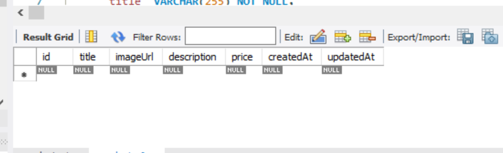
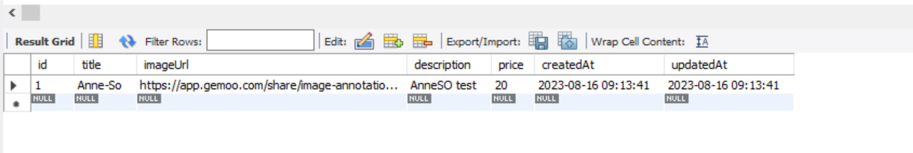

# NodeJs The complete guide (MVC, REST API, GRAPHQL, DENO)

## NodeJs

Runtime JS = JS langage de programmation utilisé dans le navigateur pour manipuler le DOM, la page, qui a été chargée dans le navigateur, permet d'intéragir avec la page après son chargement, et c'est une ^partie cruciale pour créer des interfaces utilisateur intéractives dans le navigateur.  
NodeJs est une version différente de JS, il est essentiellement contruit sur JS, il y ajoute des fonctionnalités.
Il prend JS et le place dans un environnenement différent, il permet d'exécuter du JS côté serveur comme un langage de programmation.

NodeJs utilise v8 qui est le moteur de Js, qui exécute JS dans le navigateur.
Le moteur prend le code JS, qui s'exécute dans le navigateur et le compile en code machine car c'est le code qui s'exécute finalement ur l'ordinateur et peut être géré efficacement.

On peut par exemple, travailler avec le système de fichiers local, ... NodeJs ne s'exécute pas dans le navigateur.
Permet donc d'exécuter JS sur l'ordinateur et ajoute des fonctionnalités utiles au moteur JS afin d'y faire plus de choses.

### Installer NodeJs et créer la première application

Install NodeJs
PS C:\Users\utilisateur\Desktop\GIT\NodeJS_appli_paiement> node -v
v18.14.2

cmd node (mode intéractif)
nouveau mode terminal
(calculatrice, exé JS)

Nouveau projet:
play.js

    // console.log("Hello from NodeJs");
    // (node play.js)

        // récupération fonctionnalité syst de fichiers pour travailler avec le syst de fichiers. Info Node import de cette fonctionnalités. Modul fs module principal du noeud
    const fs = require("fs");

    // appel syst de fichiers pour appeler la bonne sync de fichiers, méthode rendue possible par l'objet importé
    // Cette méthode va écrire un fichier sur le disque dur. En argument le chemin d'accès au fichier , y compris nom du fichier et le 2ème arg contenu du fichier (écrire dans un fichier via le module )
    fs.writeFileSync("hello.txt", "Hello from NodeJs again");
    node play.js
    ajout fichier txt 

### Rôle et usage de NodeJS

Pour exécuter sur un serveur pour écrire du code côté serveur.

Ecrire code sur le serveur qui renvoie des données avec lesquelles les user peuvent travailler.

C'est aussi un runtime JS: exécuter JS sans navigateur, peut être utilisé pour les scripts d'utilitaires locaux ou outils de gnération.
(REACT, Angular, ... processus de construction nécessaire à ces langages ou frameworks car excellent outil pour écrire des scripts).

On écrit pas seulement le code qui s'exécute sur le serveur, on écrit le serveur.
Exécuter la logique métier, donc pas seulement pour écouter les requêtes entrantes mais ensuite travailler avec des fichiers, travailler avec des BDD,...
Gestion des réponses, pas que pour les demandes entrantes, pour renvoyer des données au clientcome des pages HTML, données au format JSON, dossiers,...

### REPL

Exécution du code de NodeJs.
Lecture, lecture de l'entrée user, Evaluation de l'entrée user, Print sortie d'un résultat Loop boucle pour retourner et atttendre une nouvelle entrée REPL.
Avec node en commande => nous sommes dans le REPL (pas de chemin complet de l'ordinateur).
C'est un environnement où ne stockons pas notre code dans des fichiers mais nous écrivons notre application de node à chaque ligne.
"C'est un terrain de jeu".
L'alternative est d'exécuter des fichiers.

## Rapide rappel de JS

### JS en bref

- Langage de programmation faiblement typé, 
- programmation orienté objet, 
- polyvalent,
- pas d'affectation (assignement) de type explicite,
- les données d'un type peuvent être modifiées en un autre de manière dynamique, 
- flexible,
- les données peuvent être organisées en objets logiques,
- différence entre types primiitifs et types de références (voir vidéo),
- peut être exécuté hors du navigateur, configuré sur un serveur.

### Core syntaxe

play.js

    // var aso = "aso";
    // console.log(aso);

    // var age = 29;
    // var hobbie = true;
    // console.log(age, hobbie);
    // :var globales

    function summerUser(userName, userAge) {
    return `Name is ${userName} age is ${userAge}`;
    }
    // userName... utilisable seulement dans la fonction, scopes
    // appel de fonction avec arg

    console.log(summerUser(aso, age));

### let et const

var syntaxe obsolète => **let** la portée se comporte différemment.

valeur de la variable ne change jamais => **const**.

### Fonction fléchée

    const summerUser = function (userName, userAge) {
    // fonction à droite du égal: fonction anonymemais de façon implicite l'est en la stockant dans la const
    return `Name is ${userName} age is ${userAge}`;
    };s
    console.log(summerUser(aso, age));

    const summerUser = (userName, userAge) => {
        // retarit motclef function
    return `Name is ${userName} age is ${userAge}`;
    };

    console.log(summerUser(aso, age));
    => voir mot clef this

    const summerUser = (a, b) => return a + b;
    => si une seule instruction

    const summerUser = a => a= 1;
    => sans parenthèse si un seul paramètre

    const addRandom = () => 1 + 2;

### Objets, propriétés et méthodes

    // const person = {
    //   nom: "aso",
    //   prenom: "paul",
    //   // propriété ou fiel (champ)
    //   greet: () => {
    //     console.log(`hi ${this.nom}`);
    //   },
    // };

    //  objet js avec paire clé valeur, peut contenir des fonctions, var,
    // console.log(person, person.greet());
    // { nom: 'aso', prenom: 'paul' }
    // { nom: 'aso', prenom: 'paul', greet: [Function: greet] }
    // { nom: 'aso', prenom: 'paul', greet: [Function: greet] } undefined car this fait réf à la portée globale non à l'objet, il faut donc faire une fonction classique.

    const person = {
    nom: "aso",
    prenom: "paul",
    // propriété ou field (champ)
    greet() {
        console.log(`hi ${this.nom}`);
    },
    };
    console.log(person);
    person.greet();
    // hi aso

### Array

Tableaux:

    const aso = ["sport", "hello"];
    const asso = ["sport", "hello", 1, true, {}];

    for (let test of aso) {
    console.log(test);
    }
    // sport
    // hello
    // deux exécutions

    // transf tableaux, valeurs sans modifier l'ancien tableau mais en donnant un nouveau. Map prend une fonction indiquant comment éditer les éléments du tableau. Elle sera exécutée sur chaque élements du tableau, l'un après l'autre
    console.log(aso.map((as) => `hey ${as}`));
    console.log(aso);
    // [ 'hey sport', 'hey hello' ]
    // [ 'sport', 'hello' ]

### Arrays, objets et types de références

**Objets et tableaux sont des types de référence**.
Quand je stocke, par exemple, un tableau dans une constante, je peux modifier les valeurs sans violer la restriction des constantes qui ne doivent pas changer.

    aso.push("chocolat");
    // méthode push ajout d'un nouvel élément au tableau
    console.log(aso);
    => [ 'sport', 'hello', 'chocolat' ]

**Le fait de modifier la constante n'envoie pas d'erreur car les types de référence stockent uniquement une adresse pointant vers l'endroit en mémoire où ce tableau est stocké, et que l'adresse du pointeur n'a pas été modifiée par l'ajout d'un nouvel élément.**
La valeur de la cosntante, n'a pas conséquent pas changée, c'est ce sur quoi cela pointe que s'effectue le changement. Nous n'éditons pas vraiment ce qui est stockée dans une constante, nous éditons uniquement la chose vers laquelle elle pointe.

### Spread et Rest Operators

Deux opérateurs importants en JS:

disons que nous voulons implémenter le modèle où lorsque nous ajoutons un nouvel élément dans le tableau, nous ne modifions pas le tableau d'origine, mais créons un nouveau tableau avec les anciennes valeurs et la nouvelle = **immutabilité**, où nous n'avons jamais ajouté de valeurs existantes, mais où nous les remplaçons par des copies plus les modifications.
Pas de mofification de l'objet existant.
Il existe plusieurs méthodes.

    // const copieAso = aso.slice();
    // // slice opérator, l'on peut y placer des args
    // console.log(copieAso);
    // // copie du tableau

    // l'on peut passer des args
    const copieAso = [aso];
    console.log(copieAso);
    // [ [ 'sport', 'hello' ] ] array d'un array , le tableau externe n'a qu'un seul élément le tableau interne, ça n'est pas une copie mais un nouveau tableau où le premier élément est l'ancien tableau. Pas une copie, le même objet = tableau imbriqué

**spread opérator** sont des points libres ajoutés devant un tableau ou un objet: ...
ils prennent le tableau ou l'objet après l'opérateur et extraient tous les éléments d'un tableau ou propriétés d'un objet.

    const aso = ["sport", "hello"];
    const asso = ["sport", "hello", 1, true, {}];

    // const copieAso = aso.slice();
    // // slice opérator, l'on peut y placer des args
    // console.log(copieAso);
    // // copie du tableau

    // l'on peut passer des args
    const copieAso = [...aso];
    console.log(copieAso);
    // [ [ 'sport', 'hello' ] ] array d'un array , le tableau externe n'a qu'un seul élément le tableau interne, ça n'est pas une copie mais un nouveau tableau où le premier élément est l'ancien tableau. Pas une copie, le même objet = tableau imbriqué
    // [ 'sport', 'hello' ], copie de l'ancien. Extraction des éléments du tableau imbriqué précédent.

    const person = {
    nom: "aso",
    prenom: 34,
    greet() {
        console.log(`${this.nom}`);
    },
    };
    const copiePerson = { ...person };

    console.log(copiePerson);
    // copie de person { nom: 'aso', prenom: 34, greet: [Function: greet] } ajoutée à un nouvel objet

**Rest opérator**:
contraire du spread opérateur:

    const toArray = (args1, args2, args3) => {
    return [args1, args2, args3];
    };

    console.log(toArray(2, 3, 4));
    // [ 2, 3, 4 ]

    const toArray2 = (...args) => {
    return args;
    };

    console.log(toArray2(2, 3, 4));
    // [ 2, 3, 4 ] retourne un tableau avec les arguments souhaités.
**Fusion de plusieurs arguments**.

### Destructuring

    const person = {
    nom: "aso",
    age: 34,
    greet() {
        console.log(`${this.nom}`);
    },
    };

    // // structuration d'objet
    // const personName = (personData) => {
    //   console.log(personData.nom);
    // };
    // personName(person);
    // // aso

    // destructuring
    const personName2 = ({ nom }) => {
    // args propriété de l'objt entrant qui en sera extrait
    console.log(nom);
    };
    personName2(person);
    // aso

    const { nom, age } = person;
    console.log(nom, age);
    // aso 34
    // création de deux constantes pour nom et age

Peut être effectué sur des objets, tableaux:

        const hobbi = ["sport", "cooking"];
    const [hobbi1, hobbi2] = hobbi;
    console.log(hobbi1, hobbi2);
    // sport cooking
    // l'on peut choisir les noms souhaités dans ce cas car les éléments n'ont pas de nom, juste des positions. Ca sera toujours le premier élément puis deuxième

### Code asynchrone et promesses

Code asynchrone:

    setTimeout(() => {
    console.log("timer is done!");
    }, 2000);
    // attente de 2scds pour exé instruction, code async ne se produit pas immédiatemment. Fonction callback

    console.log("hello");
    console.log("");
    // code sync
    // hello

    // timer is done!

Pour travailler avec du code asynchrone, il a plusieurs techniques de gestion:
- **callback**:

    const fetchData = (callback) => {
    setTimeout(() => {
        callback("Done!");
    }, 1500);
    };

    setTimeout(() => {
    console.log("timer is done!");
    fetchData((text) => {
        console.log(text);
    });
    }, 2000);
    // créa d'une fonction fetchData qui reçoit un appel afin de définir une fonction qui devra s'exécuter une fois que la minuterie interne est effectuée à partir d'un autre endroit
    // appels async imbriqués => promesses à utiliser

    console.log("hello");
    console.log("");
    // hello

    // timer is done!
    // Done!
- **promesses**:
beaucoup utilisées dans les packages par NodeJs, rarement par nous >

   const fetchData = () => {
    const promise = new Promise((resolve, reject) => {
        setTimeout(() => {
        resolve("Done!");
        }, 1500);
    });
    return promise; //code sync
    // nouvel objet basé sur un cosntructeur JS intégré à js avec deux arg qui st des fonctions un pour accomplir la promesse avec succès et l'autre lancer une erreur. Fait auto par les packages
    };

    setTimeout(() => {
    console.log("timer is done!");
    fetchData().then((text) => {
        // callback promesse
        console.log(text);
    });
    }, 2000);
    // créa d'une fonction fetchData qui reçoit un appel afin de définir une fonction qui devra s'exécuter une fois que la minuterie interne est effectuée à partir d'un autre endroit
    // appels async imbriqués => promesses à utiliser

    console.log("hello");
    console.log("");
    // hello

    // timer is done!
    // Done!
- ...

### Littéraux de gabarits ou templates litterals

Sont des littéraux de chaînes de caractères permettant d'intégrer des expressions.
Avec eux, l'on peut utiliser des chaînes de caractères multi-lignes et fonctionnalités d'**interpolation**:

    `txt``ligne de txt1
    ligne de txt 2`
    `txt ${expression}`

## Comprendre les bases

### Comment le web fonctionne

    User/client (Browser)

    Url entry
http://

    domain lookup
browser atteint certains serveurs de noms de domaines, le domaine n'est pas vraiment l'adresse du serveur, c'est une version codée lisible par l'homme de cette adresse .Le serveur n'a qu'une adresse ip.

Le navigateur ou client envoie une requête au serveur avec l'adresse ip, adresse appartenant au nom de domaine.
L'on écrit le code qui s'exécute sur cet ordinateur, sur internet qui a cette adresse ip, code qui fait tourner le serveur capable de gérer la demande entrante et de faire quelque chose avec.
Dans ce code l'on peut faire plein de choses.

Renvoie une réponse au client, page HTML, ensuite gérée par le client, fichier, données JSON,...
Une réponse est plus que le contenu, reponsé et demande ont une en-tête(header) = méta-informations, qui sont atachées à la demande et à la réponse et décrivant ce qui s'y trouve par exemple.

La transmission des demandes et réponses se fait via un **protocole** (méthode de communication standardisée), pour gérer correctement une demande et renvoyer une réponse avec laquelle le navigateur peut fonctionner nous devons respecter certaines règles, et ces règles sont définies par le protocole utilisé, **http** ou **https**.

Http = Hyper Text Transfer Protocol, transfert de données comprises par le navigatuer et serveur.
Il défini à quoi ressemble une demande valide et comment les données doivent, être transférées du navigateur au serveur et vice versa.
Https = le même mais avec le cryptage **SSl** activé où toutes les données transmises sont cryptées.

### Création d'un serveur node

fichier app.js, fichier racine de l'application , fichier d'exécution.

core modules:
http -> lancer serveur, envoie de requête
https
fs
path
os

    const http = require("http");
    // import module http intégré dans NodeJs

    // function rqListener(req, res) {

    // }
    // // écouteru reçoit une demande qui est un message entrant, et renvoie un objet de réponse, que l'on peut utiliser pour renvoyer une réponse à la personne qui a fait cette demande.

    // http.createServer(rqListener);
    // // création serveur. Demande à create de chercher la fonction et l'exécuter pour chaque demande entrante

    http.createServer((req, res) => {
    // fonction callback appelée chaque fois qu'une reuête attteint le serveur
    console.log(req);
    // rien car aucune requête envoyée
    });
    // cette méthode de création renvoie un serveur, doit être stockée dans une var

    const server = http.createServer((req, res) => {
    console.log(req);
    });

    server.listen(8080);
    // écoute de node pour les requêtes entrantes. Prend en args port qui ne sert pas en prod. Toujours actif

### Cycle de vie de node et boucle d'événements

node app. js => start script, parcours du fichier, analyse du code, enregistrement des var ...
=>**event loop**, processus de boucle géré par NodeJs qui continue de fonctionner tant qu'il y a du travail à faire, il continue aussi longtemps qu'il ya des écouteurs d'événements enregistrés et un écouteur d'événements que nous avons enregistré.
NodeJs exécute du code JS à **thread** unique, unité de base à laquelle un OS alloue du temps processeur.
Ainsi, le processus entier de Node, utilise essentiellement un thread sur l'ordinateur sur lequel il s'exécute.
Il utilise la boucle car doit exécuter énormément de requête.
Il fait du multithread en utilisant l'OS.
Node a une boucle continue tant qu'il y a des écouteurs et créer un serveur crée un écouteur qui ne s'arrête jamais.

Voir process.exit pour se désinscrire de ce processus.

### Comprendre les requêtes

Objet request , objet de demande nodeJs généré pour nous avec toutes les données de la demande entrante lorsque 
nous avons visité localhost 8080.
Cet objet contient beaucoupe de données, fonctions, **headers**(en-têtes) qui contient des méta informations come quel navigateur est utilisé, le type de réponse accepté, cookie, 

    const http = require("http");
    // import module http intégré dans NodeJs

    const server = http.createServer((req, res) => {
    console.log(req.url, req.method, req.headers);
    });

    server.listen(8080);
    // GET {
    //     host: 'localhost:8080',
    //     connection: 'keep-alive',
    //     'sec-ch-ua': '"Not/A)Brand";v="99", "Google Chrome";v="115", "Chromium";v="115"',
    //     'sec-ch-ua-mobile': '?0',
    //     'sec-ch-ua-platform': '"Windows"',
    //     'upgrade-insecure-requests': '1',
    //     'user-agent': 'Mozilla/5.0 (Windows NT 10.0; Win64; x64) AppleWebKit/537.36 (KHTML, like Gecko) Chrome/115.0.0.0 Safari/537.36',
    //     accept: 'text/html,application/xhtml+xml,application/xml;q=0.9,image/avif,image/webp,image/apng,*/*;q=0.8,application/signed-exchange;v=b3;q=0.7',
    //     'sec-fetch-site': 'none',
    //     'sec-fetch-mode': 'navigate',
    //     'sec-fetch-user': '?1',
    //     'sec-fetch-dest': 'document',
    //     'accept-encoding': 'gzip, deflate, br',
    //     'accept-language': 'fr-FR,fr;q=0.9'
    //   }

### Envoie de réponse

    Get méthode par défaut.

        const http = require("http");
    // import module http intégré dans NodeJs

    const server = http.createServer((req, res) => {
    console.log(req.url, req.method, req.headers);
    res.setHeader("Content-Type", "text/html");
    //   def un nouvel header, content type en tête par défaut que le nav connaît, comprend et accepte
    // attache un en tête à la réponse où nous passons des méta-informations comme le type de contenu qui fera également partie de la réponse est html mais rien n'est envoyé
    res.write("<html>");
    res.write("<head><title>My first app</title></head>");
    res.write("<body><h1>Hello from node</h1></body>");
    res.write("</html>");
    res.write("</html>");
    res.end();
    //déf de l'écriture de la réponse, permet d'écrire des données dans la réponse, cela fonctionne essentiellement en plusieurs lignes. Renvoie rép avec code HTML, où nous disons au nav que c'est du code
    });

    server.listen(8080);

### Routing requests

Connexion de la req et res.
Au lieu, d'imprimer des données de demande sur la console, écrivons un serveur qui fait différente chose en fonction de la route que nous entrons,.

/ page où user peut entrer des données que nous stockons ensuite dans un fichier sur le serveur une fois qu'elles sont envoyées.
=> analyse de l'URL

const http = require("http");
// import module http intégré dans NodeJs

    const server = http.createServer((req, res) => {
    const url = req.url;
    if (url === "/") {
        res.write("<html>");
        res.write("<head><title>Enter message</title></head>");
        res.write(
        "<body><form action='/message' method='POST'><input type='txt' name='message'><button type='submit'>Send</button></form></body>"
        );
        // envoie méthode POST à /message, examine form, détecte les entrées, name message envoie auto le message dans la demande qu'il envoie au serveur
        res.write("</html>");
        res.write("</html>");
        return res.end();
        // pour ne pas continuer le code
    }
    res.setHeader("Content-Type", "text/html");
    res.write("<html>");
    res.write("<head><title>My first app</title></head>");
    res.write("<body><h1>Hello from node</h1></body>");
    res.write("</html>");
    res.write("</html>");
    res.end();
    });

    server.listen(8080);
    submit renvoie url message

### Redirection

L'on écoute pour renvoyer du HTML avec le champ de saisie au dessus.
Quand nous cliquons sur le bouton d'envoi, nous envoyons une demande de publication à /message mais nous ne faisons rien avec cela.

    const http = require("http");
    // import module http intégré dans NodeJs
    const fs = require("fs");

    const server = http.createServer((req, res) => {
    const url = req.url;
    const method = req.method;
    if (url === "/") {
        res.write("<html>");
        res.write("<head><title>Enter message</title></head>");
        res.write(
        "<body><form action='/message' method='POST'><input type='txt' name='message'><button type='submit'>Send</button></form></body>"
        );
        res.write("</html>");
        res.write("</html>");
        return res.end();
    }
    if (url === "/message" && method === "POST") {
        // redir user pour ne rien supprimer et créa nv fichier où l'on stocke le msg de l'user
        fs.writeFileSync("message.txt", "dummy");
        // ecriture méta données en une seule fois. 302 = redirection et un objet js avec certains en tête que nous voulons définir
        // res.writeHead(302, {});
        res.statusCode = 302;
        res.setHeader("Location", "/");
        return res.end();
    }
    res.setHeader("Content-Type", "text/html");
    res.write("<html>");
    res.write("<head><title>My first app</title></head>");
    res.write("<body><h1>Hello from node</h1></body>");
    res.write("</html>");
    res.write("</html>");
    res.end();
    });

    server.listen(8080);

### Parser le corps de requête

Analyse des demandes entrantes et obtention des données qui en font partie.
Comment y acccèder?
Les données entrantes sont envoyées sous forme de flux de données et c'est une construction spéciale.

Flux de données?

Incoming request

**Stream**(flux de données) est un processus continu, la demande est lue par node en morceaux =>
request Body Part 1
request Body Part 2
Fully parsed
Dans le cas d'un téléchargement de données, cela prendra du temps , et écrire sur le disque dur où l'application s'exécute pendant que les données arrivent afin de ne pas analyser l'intégralité du fichier, car beaucoup de temps.
Lon peut donc commencer à travailler sur les données qui sont arrivées, pour cela on utilise un tampon (**buffer**).
Un buffer est comme un arrêt de bus, une construction qui permet de contenir plusieurs morceaux et de travailler avec eux avant qu'ils ne soient libérés une fois que l'on a terminé

Lorsque l'on reçoit un messsage posté avant d'envoyer la réponse et d'écrire dans le fichier, nous voulons obtenir nos données de demande, on le fait en allant à la demande et en enregistrant un écouteur d'événements.

    const http = require("http");
    // import module http intégré dans NodeJs
    const fs = require("fs");

    const server = http.createServer((req, res) => {
    const url = req.url;
    const method = req.method;
    if (url === "/") {
        res.write("<html>");
        res.write("<head><title>Enter message</title></head>");
        res.write(
        "<body><form action='/message' method='POST'><input type='txt' name='message'><button type='submit'>Send</button></form></body>"
        );
        res.write("</html>");
        res.write("</html>");
        return res.end();
    }
    if (url === "/message" && method === "POST") {
        const body = [];
        req.on("data", (chunk) => {
        console.log(chunk);
        //   <Buffer 6d 65 73 73 61 67 65 3d 61 6e 6e 65 73 6f>
        body.push(chunk);
        // lecture du corps de la requête, ajout aux tab des events
        });
        req.on("end", () => {
        const parsedBody = Buffer.concat(body).toString();
        console.log(parsedBody);
        //   message=anneso paire clef valeur reçue de l'input message
        const message = parsedBody.split("=")[1];
        fs.writeFileSync("message.txt", message);
        });
        // stop écouté une fois que tous les morceaux sont arrivés, buffer objet global. créa nv tampon avec tous les morceaux de l'int du corps. toString convertir car données sont du txt
        res.statusCode = 302;
        res.setHeader("Location", "/");
        return res.end();
    }
    res.setHeader("Content-Type", "text/html");
    res.write("<html>");
    res.write("<head><title>My first app</title></head>");
    res.write("<body><h1>Hello from node</h1></body>");
    res.write("</html>");
    res.write("</html>");
    res.end();
    });

    server.listen(8080);

### Comprendre l'éxécution du code événementiel

Ordre d'exécution du code:

le code de redir est exécuté avant l'écriture dans le fichier.

    const http = require("http");
    // import module http intégré dans NodeJs
    const fs = require("fs");

    const server = http.createServer((req, res) => {
    const url = req.url;
    const method = req.method;
    if (url === "/") {
        res.write("<html>");
        res.write("<head><title>Enter message</title></head>");
        res.write(
        "<body><form action='/message' method='POST'><input type='txt' name='message'><button type='submit'>Send</button></form></body>"
        );
        res.write("</html>");
        res.write("</html>");
        return res.end();
    }
    if (url === "/message" && method === "POST") {
        const body = [];
        req.on("data", (chunk) => {
        console.log(chunk);
        //   <Buffer 6d 65 73 73 61 67 65 3d 61 6e 6e 65 73 6f>
        body.push(chunk);
        // lecture du corps de la requête, ajout aux tab des events
        });
        req.on("end", () => {
            const parsedBody = Buffer.concat(body).toString();
            console.log(parsedBody);
            //   message=anneso paire clef valeur reçue de l'input message
            const message = parsedBody.split("=")[1];
            fs.writeFileSync("message.txt", message);
            res.statusCode = 302;
            res.setHeader("Location", "/");
            return res.end();
        });
        // stop écouté une fois que tous les morceaux sont arrivés, buffer objet global. créa nv tampon avec tous les morceaux de l'int du corps. toString convertir car données sont du txt
        res.statusCode = 302;
        res.setHeader("Location", "/");
        return res.end();
    }
    res.setHeader("Content-Type", "text/html");
    res.write("<html>");
    res.write("<head><title>My first app</title></head>");
    res.write("<body><h1>Hello from node</h1></body>");
    res.write("</html>");
    res.write("</html>");
    res.end();
    });

    server.listen(8080);
Ici l'on est redirigé sur la page/message car fileSync est en attente par node et passe à la fin du code.

### Code bloquant et non bloquant

writeFileSync => **synchrone** qui bloque l'exécution du code jusqu'à l'écriture du code.
Avec un gros fichier cela est contraignant.

writeFile accepte un 3ème args: une fonction callback, qui sera exécutée quand c'est fait.

### Les coulisses

Façon dont node exécute le code pour rester performant, et être en mesure de gérer des tâches longues, travailler avec des fichiers, ...
NodeJs n'utilise qu'un seul thread JS, comme un processus de l'OS. Comment peut il gérer plusieurs requêtes car pas de thread pur chacunes, fonctionnent tous en un même thread.

Performance:
L'on a un code qui accède au système de fichiers, c'est une tâche qui prend du temps mais la boucle d'événements est automatiquement démarrée par node quand le programme démarre.
Cela est responsable de la gestion de rappels d'événements, elle gère seulement le callback.
Elle ne traite que des rappels qui contiennent du code de finition rapide.
Les opérations de longues durées sont envoyées à **worker pool**, optimisé et géré par Node. Détaché du code JS, il s'exécute sur différents thread, lié à l'OS.
La connexion à la boucle se fera quand le worker aura fini son travail, il déclenchera un rappel pour cete opération et comme la boucle est responsable des événements, et des rappels, cela finira par se retrouver dans l'event loop, Node exécutera alors le rappel approprié.

Event loop:
boucle exécutée ou démarrée par Node qui maintient le processus NodeJs en cours d'exécution et comme gère tous les callback et a un certain ordre dans lequel il passe par les rappels.
Au début de chaque nouvelle itération, il vérifie s'il y a des rappels de temporisation (timers) à exécuter (setTime,...), puis vérifie les autres rappels.
S'il y a trop de rappels en attente, il coni=tinuear son exécution en boucle et reporter     ces rappels à la prochaine itération pour les exécuter.
Puis phase d'extraction, phase où NodeJs recherchera de nouveaux événements et fera de son mieux pour exécuter leurs rappels immédiatemment si possible.
Si cela n'est pas possible, alors il retardera l'exécution et l'enregistrera essentiellement en tant que rappel en attente.
Phase de vérification. Définir immédiatement (setImmediate) est un peu comme définir un délai d'expiration ou définir un interval, juste qu'il exécutera immédiatemmment mais toujours après l'exécution de tous les rappels ouverts.
Exécution de tous les rappels d'événements de fermeture.
On peut process.exit s'il n'ya plus de gestionnaire d'événements enregistrés.
Itération.

### Node système de modules

Création d'un fichier qui contient notre logique de routage.
routes.js
Il faut connecter app.js aux routes.

Le fichier routes est mis en cache par Node et ne peut être modifié en externe.

## Flux de travail de développement et débogage amélioré

### Scripts NPM

Il est possible de définir des scripts dans Node.

**npm** node package manager, installé avec Node.
Permet d'installer des packages tiers supplémentaires, non inclus dans le core.

npm init => package.json 
json type spécial de données qui ressemble essentiellement à des objets JS, mais clés et valeurs sont toutes les deux placés dans des "", sauf number, array et bool.
L'on y a une section de scripts par défaut.
Ajout de start node app.js => cmd npm start

**Si script perso npm run nom script.**

### Installation de package tiers

Nous avons notre projet local
code 
core node packages
=> cela ne suffit souvent pas
dépendances tiers (dependencies): disponible dans le repository npm.

Nodemon
Evite de redémarrer le serveur lors des modifications de code.
npm install nodemon --save-dev

    "devDependencies": {
        "nodemon": "^3.0.1"
    }
(npm install -g en global)

Est installé dans le dossier node module (code source du package).

       

### Utiliser Nodemon pour les redémarrage automatique
    
     "start": "nodemon app.js" 

erreur usage ailleurs car installé en local sur la machine

### Global et local NPM packages

npm install package -g

### Comprendre les différnetes erreurs de types

Comment trouver et corriger les errreurs dans le code.
Il existe différents types d'erreurs:
- erreur de syntaxe: 
sera indiquée lors de l'exécution du code,
- erreur d'exécution:
runtimes errors, quand on essaie d'exécuter du code qui se cassera juste quand il s'exécutera,
- erreur logique:
pas de messages d'erreurs, 

### Trouver et corriger les erreurs de syntaxe

Dans terminal

### Runtime errors

Dans terminal.

### Logical errors

Avec l'aide du débogueur, dans VSCode run start debuging , terminal.

### Utiliser le debuggueur

Bien arrêter le processus après avoir fixé l'erreur.

## Travailler avec Express.js

### Express.js

Permet plus facilement de traiter ou analyser les données.(framework)
Développer des serveurs.
Très fexible et ajoute pas trop de fonctionnalités.

### Installer Express

npm install express --save

Doit être installé car faire partie de la production.

import dans app.js

    const express = require("express");
Gère les demandes entrantes.

### Ajouter un middleware

    Req

    Mddleware (req, res, next) => {}
        next()
    Middleware (req, res, next) => {}
        res.send()

    Res

Express = **middleware**. Une demande entrante est automatiquement dirigée à travers plusieurs fonctions, par express.js

Middleware est un concept de base de NodeJS, on peut l'utiliser après avoir construit l'objet.

    const http = require("http");
    // import module http intégré dans NodeJs

    const express = require("express");
    const app = express();
    // create app d'express, exécution de la fonction apportée par express , cela initialise un nouvel objet. Gestionnaire de requêtes
    // creation objet app pour utiliser express avant de créer le serveur
    app.use((req, res, next) => {});
    // utiliser une méthode forunie par express, permet d'ajouter une nouvelle fonction middleware. La fonction sera exécutée à chaque demande entrante et elle reçoit 3 args
    // next fonction transmise à la fonction par express: permet à la demande de passer au middleware svt
    const server = http.createServer(app);

    server.listen(8080);

        app.use((req, res, next) => {
    console.log("hjey");
    next();
    //   permet de passer au middleware suivant
    });
    app.use((req, res, next) => {
    console.log("o");
    });

Next permet à la req de continuer son chemin sinon il faut envoyer une réponse.

### Comment fonctionne un middleware

Un middleware est un concept essentiel du framework express.
Express n'envoie pas de réponse par défaut.
Grâce à express, en tête, content,... sont fournis et par défaut.
Lecture middleware de haut en bas.

### Coulisses d'Express

app.listen => création de serveur et écoute sur le server.

    const express = require("express");
    const app = express();
    // create app d'express, exécution de la fonction apportée par express , cela initialise un nouvel objet. Gestionnaire de requêtes
    // creation objet app pour utiliser express avant de créer le serveur
    app.use((req, res, next) => {
    console.log("hjey");
    next();
    //   permet de passer au middleware suivant
    });
    app.use((req, res, next) => {
    console.log("o");
    res.send("<h1>Hello from express</h1>");
    //   envoie d'une réponse
    });
    // utiliser une méthode fournie par express, permet d'ajouter une nouvelle fonction middleware. La fonction sera exécutée à chaque demande entrante et elle reçoit 3 args
    // next fonction transmise à la fonction par express: permet à la demande de passer au middleware svt

    app.listen(8080);

### Gestion des différentes routes

    const express = require("express");
    const app = express();

    app.use("/add-product", (req, res, next) => {
    console.log("o");
    res.send("<h1>Ajout de produit</h1>");
    });
    app.use("/", (req, res, next) => {
    console.log("o");
    res.send("<h1>Accueil</h1>");
    });

    app.listen(8080);

### Analyser les requêtes entrantes

Comment travailler avec les requêtes et comment extraite les données.

npm install body-parser

analyser le coprs de la req

    const express = require("express");
    const bodyParser = require("body-parser");
    const app = express();

    app.use(bodyParser.urlencoded({ extended: false }));
    // analyseur du corps de la req. Enregistre un middleware. Analyse en premier le coprs de la req

    app.use("/add-product", (req, res) => {
    res.send(
        "<form action='/product' method='POST' ><input type='text' name='titre'><button type='submit'>Ajout de produit</button></form>"
    );
    });
    app.use("/product", (req, res) => {
    console.log(req.body);
    //   undefined car req donne la ppt de corps body, mais par défaut req n'analyse pas le corps il fautun parser(analyseur) => { titre: 'aso' }
    res.redirect("/");
    });
    app.use("/", (req, res, next) => {
    res.send("<h1>Accueil</h1>");
    });

    app.listen(8080);

### Utiliser le router express

Externaliser le routage express dans d'autres fichiers.

Dossier routes

### Page 404

### Filtrage des chemins

Caractéristique du routeur express.
Parfois les routes ont un chemin de départ externalisé commun, avec différentes méthodes.

app.use("/admin", adminRoutes);

### Création de page HTML

### Retourner page 404

### Utiliser une fonction d'assistance à la navigation

Pour obtenir le répertoire parent. (__dirname)

helpers path.js

### Style

pointer les fichiers css
dossier public contient du contenu exposé au public
Il faut que certaines requêtes puissent accèder au système de fichiers
erreur 404
Il faut utiliser une fonctionnalité d'express:
pour servir des fichiers de façon statique, directement transmis au système de fichiers.

middleware
express.static
pour servir un dossier statiquement
accès lecture
image, style, ...

## Travailler avec du contenu dynamique et ajout de templates 

Actuellement on renvoie des pages HTML statiques.
Il est plutôt courant que certaines données soient gérées par le serveur, également dans la BDD.
Sortir dinamyqueme,t le code HTML que l'on veut renvoyer aux user.

### Partage de demandes enttre les demandes et les user

Actuellement l'on ne travaille pas avec les données de l'application directement.
Sans bdd on peut les stocker dans une var.
Exemple: titre devrait être stocké de façon permanente.

    const express = require("express");
    const path = require("path");
    const router = express.Router();
    // mini app express liée à express
    const products = [];
    // /admin/add-product
    router.get("/add-product", (req, res) => {
    res.sendFile(path.join(__dirname, "..", "views", "add-product.html"));
    });
    router.post("/add-product", (req, res) => {
    // console.log(req.body);
    //   undefined car req donne la ppt de corps body, mais par défaut req n'analyse pas le corps il fautun parser(analyseur) => { titre: 'aso' }

    res.redirect("/");
    });

    module.exports = { router, products };

### Templating engines 

Mettre du contenu dynamiquedans les pages HTML.

On a un HTMLish Template, contient du code HTML, la structure,... qui contient également des contenus réservés.
Il y a le contenu de NodeJS/express comme tableau factice, et un moteur de templates qui comprend une certaine syntaxe pour laquelle il analyse le HTMLish template et où il remplace les espaces réservés ou certains extraits de code en fonction du moteur utilisé, avec du vrai code HTML, mais ce contenu est généré par le serveur à la volée.
Les user obtiennent une page HTML non codée en dure.

EJS, PUG et Handlebars sont les plus connus.

EJS => 
<%= name %>

PUG => p #{name}

HandleBars => 
{{ name }}

### Installation et mise en oeuvre de EJS

 npm install --save ejs pug express-handlebars

dossier includes
code partagés par les pages

<%- mieux que <%= pour sortir du code html échappé, par défaut avec = on sort une var qui contient du code html, il ne le rendrait pas mais rendrait sous forme de texte pour éviter les attaques de script intersite, avec le moins on évite cela et rendre le code HTML directement.

## MVC model view controller

Structurer le code, séparation logique du code et les différentes fonctions.

### MVC?

Séparation des préoccupations.
Les différentes parties du code fonct différentes choses.

- **Views**: ce que voit l'user à la fin, rendre le bon contenu dans les docs html et le renvoyer à l'user. Elles sont découplées du code de l'application. Et ont juste quelques intégrations majeures ou mineures concernant les données qui lui sont injectées, dans le moteur de modèle pour générer des vues,
- **Models**: objets ou font partie du code qui est chargé de représenter les données dans le code, et permette de travailler avec les données comme suavegarde des données,... ,
- **Controllers**: point de connexion entre les views et les models, commes les views ne se soucient pas de la logique d'application et que les models se soucient de la façon dont on sauvegarde les données, extraction des données, ..., les controllers sont la chose qui fonctionne avec les models, en enregistrant ces données ou en déclenchant le processus de sauvegarde,... C'est l'intermédiare, il contient la logique intermédiaire.

Les routes, sont essentiellement les choses qui définissent sur quel chemin pour quelle méthode http quel controller doit exécuter.
C'est le model dans une application avec express ou construit avec express qui repose fortement sur le concept de middleware, les controllers sont divisés entre les fonctions de middleware où une partie de la logique peut être séparée et déplacée.
 dans une autre fonction middleware.

 ### Ajout de controllers

Toute la logique repose sur les produits.
Création dossier controllers, products.js
export fct get dans admin.js pour l'ajouter dans la route

### Ajout d'un mmodel de produit

### Stockage de données dnas des fichiers via models

Ne plus enregistrer les produits dans un tab mais dans un fichier.

    const fs = require("fs");
    const path = require("path");

    module.exports = class Product {
    constructor(title) {
        this.title = title;
        // prop de la classe construire objet de cette classe
    }

    save() {
        const p = path.join(__dirname, "..", "data", "products.json");
        fs.readFile(p, (err, fileContent) => {
        var products = [];
        if (!err) {
            products = JSON.parse(fileContent);
            //    objet de NODE qui prend les json entrant et les convertit en tab
        }
        products.push(this);
        fs.writeFile(p, JSON.stringify(products), (err) => {
            console.log(err);
        });
        //   convert tab ou objet en json
        });
    }
    //   méthode de sauvegarde à la la classe pour sauvegarder le produit dans le tab. This car fait réf à l'objet créé

    static fetchAll() {
        const p = path.join(__dirname, "..", "data", "products.json");
        fs.readFile(p, (err, fileContent) => {
        if (err) {
            return [];
        }
        return JSON.parse(fileContent);
        //   renvoi tab sous forme analysée
        });
    }
    //   recup des objets static permet de recup les objets sur la classe elle même et non sur l'objet instancié
    };

error length => 

     fs.readFile(p, (err, fileContent) => {
        if (err) {
            return [];
        }
        return JSON.parse(fileContent);
        //   renvoi tab sous forme analysée
        });
        => code async 
    fecthAll exécute la igne path, puis fs.read mais enregistre if dans son registre d'events pour le mettre et se termine avec fetchAll qui ne retourne rien.
    L'on peut mettre un callback dans fetchAll en args, pour passer une fonction dans fetchAll, fetchAll s'exzcutera une fois cela fait, de sorte que ce qui appelle fetchAll peut passer une fonction dont il a conscience d'être appelée et qui contient les données à retourner.
    Cela permet d'aller sur le controller, où l'on appel fetchAll.

### Refactorisation du code

Création d'une focntion d'aide, dans une const (models product.js).
Elle permettra de récupèrer les prod à partir d'un fichier, et elle fera la construction de chemin pour nous.

## Améliorer l'application

### Créer la structure du shop

Views:
dossier admin, shop
index.ejs page accueil
cart.ejs panier
checkout paiement

### Mise à jour de la navigation

### Enregistrer les routes

routes
puis controller

### Stockage des données produit

Plus de logique dans l'ajout d'un produit.

### Affichage des données produits

product-list.ejs

    <%- include('../includes/head.ejs') %>
    <link rel="stylesheet" href="/css/product.css">
</head>

<body>
    <%-include ('../includes/navigation.ejs') %>

    <main>
        <% if (prods.length >0) { %>
        

            <% for (let products of prods) { %>
                <article class="card product-item">
                    <header class="card__header">
                        <h1 class="product__title"><%= products.title %></h1>
                    </header>
                    

                        
                    

                    

                        <h2 class="product__price">$19.99</h2>
                        
A very interesting book about so many even more interesting things!

                    

                    

                        <button class="btn">Add to Cart</button>
                    

                </article>
            <% } %>
        

        <% } else { %>
            <h2>Pas de produits trouvés!</h2>
        <% } %>
    </main>

    <%- include ('../includes/end.ejs') %>
    Avant

### Modification et suppression de produits

### Ajouter un nouvel élément

## Routes dynamiques et modèles avancés

Nous avons besoin de transmettre des données dynamiques via nos routes.
Nosu voulons être en mesure de coder certaines informations dans notre URL afin que nous puissions par exemple transmettre un id de produit dans le cadre de l' URL.

### Ajustement du projet

### Ajout de l'id dans l'URL

Le model doit avoir un id.
id dans ejs products.id

### Extraire les paramètres dynamiques

routes shop.js
L'on peut dire à express que l'on aura un segment variable en ajoutant **":"** et le nom.
Lecture des routes de haut en bas, si même chemin celui avec le bond doit être positionné après sinon les routes suivantes ne seraient pas reconnues.
routes spécifiques en haut.
controller:

    const prodId = req.params.productId
    nom par lequel on extrait les données après :

routes maj connection au controller.

### Charger les données d'un détail de produit

model
controller
findById

### Renvoyer la vue des détails

### Passer des données avec la requête POST

Ajout d'un article au panier.
L'on peut transmettre des données dans le corps de la requête pour une méthode post.

### Ajout d'un model panier

Entité disticnte du projet.

### Utiliser les query params

edit-product.ejs
Même formulaire que add-product mais avec des champs pré remplis, suppression de add-product.ejs.
Nous voulons obtenir une confirmation supplémentaire, 
en nous assurant que les user doivent nous passer un paramètre de requête dans l'URL.
Dans n'importe quelle URL,**en ajoutant un ?paire clef=valeur**.
L'on peut avoir plusieurs paramètres en les séparant par &.

http://localhost:8080/admin/edit-product/0.5752015382396547?edit=true&title=cool

Ce sont des données facultatives.
L'itinéraire atteint est celui après le point d'interrogation.
Nous n'avons pas besoin de rajouter des informations sur les paramètres de requête que l'on pourrait avoir dans le fichier routes. Les chemins ne sont pas affectés.
Mais l'on peut toujours les vérifier, dans les controller:

    const editMode = req.query => y'a t'il dans la requête un objet.
La valeur extraite est un string, donc "true" not true.

### Pré-remplir la page edit product

Il faut fetch le produit, en mode edit true.
Besoin de l'id product.

    exports.getEditProduct = (req, res) => {
    // verification if req have an object (edit:key), l'on obtiendra la valeur souhaitée:
    const editMode = req.query.edit;
    if (!editMode) {
        return res.redirect("/");
    }
    // Fetch product id to fecth product to edit (pre populatng form)
    const prodId = req.params.productId;
    // Use Product model to find product associate to the id with callback for the product to render the page
    Product.findById(prodId, (product) => {
        if (!product) {
        return res.redirect("/");
        }
        res.render("admin/edit-product", {
        pageTitle: "Edition d'articles",
        path: "/admin/edit-product",
        // edition if req's parameter
        editing: editMode,
        product: product,
        });
    });
    };

### Lier la page d'édition de produits

### Editer les données produits

save() dans le model product permet actuellement de qauvegarder un nouvel objet:

     save() {
        this.id = Math.random().toString();
        // id unique convertit en varchar
        getProductsFromFile((products) => {
        products.push(this);
        fs.writeFile(p, JSON.stringify(products), (err) => {
            console.log(err);
        });
        });
        //   convert tab ou objet en json
    }
Nous allons l'utiliser pour mettre à jour un produit déjà existant:
vérification de l'id, s'il existe déjà, nous allons donc ajouter l'id au constructeur ainsi un id sera attribué aux produits n'en ayant pas.

      save() {
    getProductsFromFile((products) => {
      if (id) {
        // verify of product existing, searching index of existing product
        const existingProductId = products.findIndex(
          (prod) => prod.id === this.id
        );
        // create update array with search, extracte property all existing products in new array
        const updatedProducts = [...products];
        // replace index with information of existing product found and new create
        updatedProducts[existingProductId] = this;
        fs.writeFile(p, JSON.stringify(products), (err) => {
          console.log(err);
        });
      } else {
        this.id = Math.random().toString();
        // id unique convertit en varchar
        products.push(this);
        //
        fs.writeFile(p, JSON.stringify(products), (err) => {
          console.log(err);
        });
      }
    });
  }

Dans le controller:
lors de l'ajout du nouveau produit (postAdddProduct) => ajout property id.

### Supprimer des articles du panier, et des produits

### Affichage des articles du panier
 
### Suppression des articles du panier

### Bogue de suppression de produit

Quan le panier est vide, le fait de supprimer un produit par l'admin entraîne une erreur.
En effet, dans le product'models, nous utilisons la propriété qty de cart's models.

## Introduction à SQL

Base de données, programme spécifique qui est conçu pour stocker des données et les récupèrer.

### Choisir une bdd

SQL ou noSQL?

Objectif: stocker des données et les rendre facilement accessible ou disponible, rapide.

SQL: MySQl (moteur de bdd),...
NoSql: MongoDB,...

Base SQL:
tables, qui ont des champs ou colonnes.
Nous remplissons les données de ces champs = enregistrements (tuples).
Nous pouvons lier les tables.
**Tables relationnelles**;

Schéma de données solide, chaque table est clairement définie.

Trois types de relations entre les tables:
- one to one, chaque enregistrement correspond à un autre enregistrement,
- one to many, un enregistrement peut en contenir plusieurs,
- many to many, plusieurs enregistrements peuvent en contenir plusieurs.

**SQL** signifie langage de requête structuré (structured query langage).
Les requêtes sont des commandes que nous utilisons pour interagir avec la base de données.

### Connecter la BDD à l'API

npm install --save mysql2

Permet d'écrire et exécuter du code SQL dans nodeJS.

Connexion BDD:
dossier util, connexion BDD et rendre un objet de connexion qui nous permet d'exécuter des requêtes.

    // import & store mysql's package to use
    const mysql = require("mysql2");

    // create connection's pool, object mysql. pool is better for multi queries. one req one connection. when req is finished, connection is retransmitted  in the pool et she's new available for a new query.
    // passed a js object with informations about dbb
    const pool = mysql.create({
    host: "localhost",
    user: "root",
    database: "boutique",
    password: "root",
    });

    // export to use pool with promise to use promise when we work with this connextion who manage async tasks. We don't have nests callback
    module.exports = pool.promise();

### Création de tables BDD

Promesses ont deux fonctions:

**then** et **catch**.
Fonctions qui peuvent être enchaînées sur le résultat du code exécuté.
S'exécutent qur ce que nous rendra la requête, une **promesse** est un objet JS non spécifique à NodeJs, se trouve aussi dans le js du naviq=gateur.
Cela nous permet de travailler avec du code **asynchrone**.
Au lieu d'utiliser des rappels, nous utilisons le package mysql2, les promesses permetttent d'écrire du code plus structué.
Au lieu d'avoir des fonctions anonymes imbriquées comme deuxième argument, l'on a un bloc then qui obtiendra alors la fonction anonyme exécuter.
Catch s'exécute en cas d'erreurs, l'on obtient l'objet error.

Récu^ération d'un tableau imbriqué, avec un objet contenant des objets.
Le premier tableau contient nos données, et le second des métadonnées sur la table.

app.js:

    // execute connection db. Then use promise of connection
    // db.execute("SELECT * FROM products")
    //   //result of req
    //   .then((result) => {
    //     // fetch only arry of data products
    //     console.log(result[0]);
    //   })
    //   //   get error object
    //   .catch((err) => {
    //     console.log(err);
    //   });
### Récupèrer les données produits

Travail à partir des models.

product.js models avant:

    const fs = require("fs");
    const path = require("path");
    const p = path.join(__dirname, "..", "data", "products.json");

    const Cart = require("./cart");

    const getProductsFromFile = (cb) => {
    fs.readFile(p, (err, fileContent) => {
        //   rappel d'un tab vide
        if (err) {
        cb([]);
        } else {
        cb(JSON.parse(fileContent));
        //   renvoi tab sous forme analysée
        }
    });
    //   recup des objets satic permet de recup les objets sur la classe elle même et non sur l'objet instancié
    };

    module.exports = class Product {
    constructor(id, title, imageUrl, description, price) {
        this.id = id;
        this.title = title;
        this.imageUrl = imageUrl;
        this.description = description;
        this.price = price;
        // prop de la classe construire objet de cette classe
    }

    save() {
        getProductsFromFile((products) => {
        if (this.id) {
            // verify of product existing, searching index of existing product
            const existingProductIndex = products.findIndex(
            (prod) => prod.id === this.id
            );
            // create update array with search, extracte property all existing products in new array
            const updatedProducts = [...products];
            // replace index with information of existing product found and new create
            updatedProducts[existingProductIndex] = this;
            fs.writeFile(p, JSON.stringify(updatedProducts), (err) => {
            console.log(err);
            });
        } else {
            this.id = Math.random().toString();
            // id unique convertit en varchar
            products.push(this);
            fs.writeFile(p, JSON.stringify(products), (err) => {
            console.log(err);
            });
        }
        });
    }
    //   méthode de sauvegarde à la la classe pour sauvegarder le produit dans le tab. This car fait réf à l'objet créé

    static deleteById(id) {
        // delete product by id and delete in the cart
        getProductsFromFile((products) => {
        // search in product products'id to delete, we can extracte product.price to update cart
        const product = products.find((prod) => prod.id === id);
        // console.log(products);
        // keep only product no deleted
        const updatedProducts = products.filter((prod) => prod.id !== id);
        fs.writeFile(p, JSON.stringify(updatedProducts), (err) => {
            if (!err) {
            // call delete product in the cart's model with product's id to delete
            Cart.deleteProduct(id, product.price);
            }
        });
        });
    }

    static fetchAll(cb) {
        getProductsFromFile(cb);
    }

    static findById(id, cb) {
        getProductsFromFile((products) => {
        const product = products.find((p) => p.id === id);
        // fct synch n'exécute aucun code
        cb(product);
        });
        // filtrage des produits avec l'id
    }
    };

shop.js avant:

    const Product = require("../models/product");
    const Cart = require("../models/cart");

    exports.getProducts = (req, res) => {
    Product.fetchAll((products) => {
        res.render("shop/product-list", {
        prods: products,
        pageTitle: "Articles",
        path: "/products",
        hasProducts: products.length > 0,
        activeShop: true,
        productCss: true,
        });
    });
    // console.log(adminData.products);
    //  données inhérentes à Node, il faut donc réussir à les partager seulement pour l'user dont vient la demande
    //   concat des différents segments du chemin __dirname var globale node qui contient le chemin absolu du système d'exploitatioon vers ce dossier de projet détecte l'os pour faire le chemin
    };
    // get accueil avec les prod ajoutés /

    exports.getProduct = (req, res) => {
    const prodId = req.params.productId;
    Product.findById(prodId, (product) => {
        res.render("shop/product-detail", {
        product: product,
        prods: product,
        pageTitle: "Détail de l'article",
        path: "/products",
        });
    });
    };
    // get détails livre  "/products/:productId"

    exports.getIndex = (req, res) => {
    Product.fetchAll((products) => {
        res.render("shop/product-list", {
        prods: products,
        pageTitle: "Boutique",
        path: "/",
        });
    });
    };
    // get index

    exports.getCart = (req, res) => {
    Cart.getCart((cart) => {
        Product.fetchAll((products) => {
        // no product in  cart => []
        const cartProducts = [];
        for (product of products) {
            const cartProductData = cart.products.find(
            (prod) => prod.id === product.id
            );
            // extract cart's product from cart
            if (cartProductData) {
            cartProducts.push({ productData: product, qty: cartProductData.qty });
            }
        }
        res.render("shop/cart", {
            pageTitle: "Panier",
            path: "/cart",
            products: cartProducts,
        });
        });
    });
    };
    // get panier

    exports.postCart = (req, res) => {
    const prodId = req.body.productId;
    // search product by id set in URL
    Product.findById(prodId, (product) => {
        // product receive by search in BDD to post into cart
        Cart.addProduct(prodId, product.price);
    });
    res.redirect("/cart");
    };

    exports.postCartDeleteProduct = (req, res) => {
    // extract id of product we want to delete in cart
    const prodId = req.body.productId;
    // obtention product' informations (price) to update cart
    Product.findById(prodId, (product) => {
        Cart.deleteProduct(prodId, product.price);
        res.redirect("/cart");
    });
    };

    exports.getCheckout = (req, res) => {
    res.render("shop/checkout", {
        pageTitle: "Paiement",
        path: "/checkout",
    });
    };
    // get page paiement

    exports.getOrders = (req, res) => {
    res.render("shop/orders", {
        pageTitle: "Commande",
        path: "/orders",
    });
    };
    // get page paiement

### Ajout de produit

admin.js controller

    const Product = require("../models/product");

    exports.getAddProduct = (req, res) => {
    res.render("admin/edit-product", {
        pageTitle: "Ajout d'articles",
        path: "/admin/add-product",
        editing: false,
    });
    };
    // accès page ajout produit GET /admin/add-product

    exports.postAddproduct = (req, res) => {
    // console.log(req.body);
    //   undefined car req donne la ppt de corps body, mais par défaut req n'analyse pas le corps il fautun parser(analyseur) => { titre: 'aso' }
    //   products.push({ title: req.body.title });
    const title = req.body.title;
    const imageUrl = req.body.imageUrl;
    const description = req.body.description;
    const price = req.body.price;
    // null for id because if we added a new product id his not define
    const product = new Product(null, title, imageUrl, description, price);
    product.save();
    res.redirect("/");
    };
    // sur page addProduct POST new product /admin/add-product

    exports.getEditProduct = (req, res) => {
    // verification if req have an object (edit:key), l'on obtiendra la valeur souhaitée:
    const editMode = req.query.edit;
    if (!editMode) {
        return res.redirect("/");
    }
    // Fetch product id to fecth product to edit (pre populatng form)
    const prodId = req.params.productId;
    // Use Product model to find product associate to the id with callback for the product to render the page
    Product.findById(prodId, (product) => {
        if (!product) {
        return res.redirect("/");
        }
        res.render("admin/edit-product", {
        pageTitle: "Edition d'articles",
        path: "/admin/edit-product",
        // edition if req's parameter
        editing: editMode,
        product: product,
        });
    });
    };

    exports.postEditProduct = (req, res) => {
    // Fetch informations to the product we want to updated. (need an input in view edit-product to store existing product's id )
    const prodId = req.body.productId;
    const updatedTitle = req.body.title;
    const updatedImageUrl = req.body.imageUrl;
    const updatedDesc = req.body.description;
    const updatedPrice = req.body.price;
    // Create a new product instance (product updated) with new informations and call save() of product's model
    const updatedProduct = new Product(
        prodId,
        updatedTitle,
        updatedImageUrl,
        updatedDesc,
        updatedPrice
    );
    // call save method to save new instance with updated information's product
    updatedProduct.save();
    res.redirect("/admin/products");
    };
    // cosntruire et remplacer le produit existant

    exports.getProducts = (req, res) => {
    Product.fetchAll((products) => {
        res.render("admin/products", {
        prods: products,
        pageTitle: "Articles",
        path: "/admin/products",
        });
    });
    };

    exports.postDeleteProduct = (req, res) => {
    // extract prod id to delete from the request body
    const prodId = req.body.productId;
    console.log(prodId);

    Product.deleteById(prodId);
    res.redirect("/admin/products");
    };

## Sequelize

Nous n'écrirons plus des instrcutions SQL, nous utiliserons un package tiers qui nous permet de travailler avec des objets JS et des méthodes pour gérer la bdd.

### Sequelize?

Package tiers de NodeJS, c'est une bibliothèque de mappage relationnel objet.
Il fait le code SQL en arrière plan, et le map en objet JS avec des méthodes que nous pouvons appeler pour éxécuter ce code, nous n'écrivons donc jamais de code SQL par nous même.
Notre objet, model est mapé à une table de bdd par séquencement, il crée automatiquement cette table pour nous même, il établit automatiquement des relations et des tables.
Par exemple, lorsque nous créons un user, l'on appelle une méthode sur cet objet JS user et Sequelize exécute la requête SQL requise.

**models**: définir quelles données définissent un models et quelles données seront enregistrées dans la bdd.
=> Models: User
L'on peut ensuite instancier ces models, ces "classes", nous pouvons éxécuter les fonctions constructeurs ou utiliser des méthodes utilitaires pour créer un nouvel objet basé sur ce models afin que nous ayons une connexion , et ensuite exécuter des requêtes dessus.
=> Instances: const user = User.build()
=> Queries: User.findAll()
L'on peut également associer des models.
=> Associations: User.hasMany(Product).

### Connection à la bdd

npm install --save sequelize

Sequelize a besoin du package MySql2 pour fonctionner.

Création d'un models sequelize et connection à la bdd.
(drop table products)

database.js util avant:

    // import & store mysql's package to use
    const mysql = require("mysql2");

    // create connection's pool, object mysql. pool is better for multi queries. one req one connection. when req is finished, connection is retransmitted  in the pool et she's new available for a new query.
    // passed a js object with informations about dbb
    const pool = mysql.createPool({
    host: "localhost",
    user: "root",
    database: "boutique",
    password: "root",
    });

    // export to use pool with promise to use promise when we work with this connextion who manage async tasks. We don't have nests callback
    module.exports = pool.promise();

### Définir un model

product.js models avant:

    // import db to access db
    const db = require("../util/database");

    // Create product object
    module.exports = class Product {
    constructor(id, title, imageUrl, description, price) {
        // property of object
        this.id = id;
        this.title = title;
        this.imageUrl = imageUrl;
        this.description = description;
        this.price = price;
    }

    // Insert and save data in db
    save() {
        // reach db to save data
        // create data in products, id auto generate by bdd
        // to save without SQL injection (attack with injection special data in input field like SQL query) we use ? and [] with order field
        return db.execute(
        "INSERT INTO products (title, imageUrl, description, price) VALUES (?, ?, ?, ?)",
        [this.title, this.imageUrl, this.description, this.price]
        );
    }

    static deleteById(id) {}

    // Get all products from db
    static fetchAll() {
        // reach bdd and execute query get products in db
        return db.execute("SELECT * FROM products");
    }
    // Get by id from db
    static findById(id) {
        return db.execute("SELECT * FROM products WHERE products.id = ?", [id]);
    }
    };

### Synchronisation des models avec la BDD

app.js
synchro des tables
=> sequelize exécute cette requête SQL automatiquement:

    Executing (default): SELECT TABLE_NAME FROM INFORMATION_SCHEMA.TABLES WHERE TABLE_TYPE = 'BASE TABLE' AND TABLE_NAME = 'products' AND TABLE_SCHEMA = 'boutique'
    Executing (default): CREATE TABLE IF NOT EXISTS `products` (`id` INTEGER NOT NULL auto_increment , `title` VARCHAR(255), `imageUrl` VARCHAR(255) NOT NULL, `description` VARCHAR(255) NOT NULL, `price` DOUBLE PRECISION NOT NULL, `createdAt` DATETIME NOT NULL, `updatedAt` DATETIME NOT NULL, PRIMARY KEY (`id`)) ENGINE=InnoDB;
    Executing (default): SHOW INDEX FROM `products`
    <ref *1> Sequelize {

Sequelize pluralise automatiquement.
Deux nouveaux champs sont ajoutés par sequelize:

Sequelize gère automatiquement certains horodatage pour nous.

### Insertion des données et création de produits

admin.js controller, avant:

    // import product's model
    // import product's model
    const Product = require("../models/product");

    //Page admin ajout produit GET /admin/add-product
    exports.getAddProduct = (req, res) => {
    res.render("admin/edit-product", {
        pageTitle: "Ajout d'articles",
        path: "/admin/add-product",
        // if editing false get add product form if true we get update product form => views ejs edit-product
        editing: false,
    });
    };

    // Page admin ajout de produit POST new product /admin/add-product
    exports.postAddproduct = (req, res) => {
    const title = req.body.title;
    const imageUrl = req.body.imageUrl;
    const description = req.body.description;
    const price = req.body.price;
    // null for id because if we added a new product id his not define
    const product = new Product(null, title, imageUrl, description, price);
    product
        .save()
        // redirect only when insertion is finished
        .then(res.redirect("/"))
        .catch((err) => console.log(err));
    };

    exports.getEditProduct = (req, res) => {
    // verification if req have an object (edit:key), l'on obtiendra la valeur souhaitée:
    const editMode = req.query.edit;
    if (!editMode) {
        return res.redirect("/");
    }
    // Fetch product id to fecth product to edit (pre populatng form)
    const prodId = req.params.productId;
    // Use Product model to find product associate to the id with callback for the product to render the page
    Product.findById(prodId, (product) => {
        if (!product) {
        return res.redirect("/");
        }
        res.render("admin/edit-product", {
        pageTitle: "Edition d'articles",
        path: "/admin/edit-product",
        // edition if req's parameter
        editing: editMode,
        product: product,
        });
    });
    };

    exports.postEditProduct = (req, res) => {
    // Fetch informations to the product we want to updated. (need an input in view edit-product to store existing product's id )
    const prodId = req.body.productId;
    const updatedTitle = req.body.title;
    const updatedImageUrl = req.body.imageUrl;
    const updatedDesc = req.body.description;
    const updatedPrice = req.body.price;
    // Create a new product instance (product updated) with new informations and call save() of product's model
    const updatedProduct = new Product(
        prodId,
        updatedTitle,
        updatedImageUrl,
        updatedDesc,
        updatedPrice
    );
    // call save method to save new instance with updated information's product
    updatedProduct.save();
    res.redirect("/admin/products");
    };
    // cosntruire et remplacer le produit existant

    exports.getProducts = (req, res) => {
    Product.fetchAll((products) => {
        res.render("admin/products", {
        prods: products,
        pageTitle: "Articles",
        path: "/admin/products",
        });
    });
    };

    exports.postDeleteProduct = (req, res) => {
    // extract prod id to delete from the request body
    const prodId = req.body.productId;
    console.log(prodId);

    Product.deleteById(prodId);
    res.redirect("/admin/products");
    };
Ajout de produit:

### Récupération et recherche des produits

shop.js controller

### Trouver un seul produit avec la condition where

### Récupèrer les produits admin

### Modifier les produits

### Effacer des prduits

### Créer un profil utilisateur

### Ajouter une association un à plusieurs

one to many:
relation ou association.

user: un user n'a qu'un seul panier => **has one** mais peut avoir plsuieurs commandes => **has many**. Il peut aussi avoir créé plusieurs produits **has many** (ne le possède pas l'a créé)
cart
order
product: un produit appartient à plusieurs paniers(cart) et plusieurs commandes => **belongs to many**, plusieurs users peuvent ajouter le même produits dans leurs paniers.

    const express = require("express");
    const bodyParser = require("body-parser");
    const app = express();
    const path = require("path");
    const pageNotFoundController = require("./controllers/error");
    // import connection bdd
    const sequelize = require("./util/database");
    // import models module
    const Product = require("./models/product");
    const User = require("./models/user");

    // To use EJS with Express.
    app.set("view engine", "ejs");
    // config var globale pour pug sur notre app express lui dire où trouver le moteur de template
    app.set("views", "views");

    const adminRoutes = require("./routes/admin");
    const shopRoutes = require("./routes/shop");

    app.use(bodyParser.urlencoded({ extended: false }));
    // analyseur du corps de la req. Enregistre un middleware. Analyse en premier le coprs de la req
    app.use(express.static(path.join(__dirname, "public")));
    // middleware lecture seul
    app.use("/admin", adminRoutes);
    app.use(shopRoutes);

    app.use(pageNotFoundController.get404Page);

    // Association table db:
    // a product is created by user(admin)
    Product.belongsTo(User, {
    // facultative
    constraints: true,
    // if user deleted product too =< cascade
    onDelete: "Cascade",
    });
    // one user can create many products
    User.hasMany(Product);

    // Verify and sync models and tables in db. If table doesn't exist sequelize create table and sequelize define association
    sequelize
    // force true to force sequelize take all new information on table already created (association and create FK after create models user)
    .sync({ force: true })
    .then((result) => {
        // see an object
        // if sync db ok, server is open
        app.listen(8080);
    })
    .catch((err) => console.log(err));

### Créer et gérer un user

    const express = require("express");
    const bodyParser = require("body-parser");
    const app = express();
    const path = require("path");
    const pageNotFoundController = require("./controllers/error");
    // import connection bdd
    const sequelize = require("./util/database");
    // import models module
    const Product = require("./models/product");
    const User = require("./models/user");

    // To use EJS with Express.
    app.set("view engine", "ejs");
    // config var globale pour pug sur notre app express lui dire où trouver le moteur de template
    app.set("views", "views");

    const adminRoutes = require("./routes/admin");
    const shopRoutes = require("./routes/shop");

    app.use(bodyParser.urlencoded({ extended: false }));
    // analyseur du corps de la req. Enregistre un middleware. Analyse en premier le coprs de la req
    app.use(express.static(path.join(__dirname, "public")));
    // middleware lecture seul
    app.use("/admin", adminRoutes);
    app.use(shopRoutes);

    app.use(pageNotFoundController.get404Page);

    // Association table db:
    // a product is created by user(admin)
    Product.belongsTo(User, {
    // facultative
    constraints: true,
    // if user deleted product too =< cascade
    onDelete: "Cascade",
    });
    // one user can create many products
    User.hasMany(Product);

    // Verify and sync models and tables in db. If table doesn't exist sequelize create table and sequelize define association
    sequelize
    // force true to force sequelize take all new information on table already created (association and create FK after create models user)
    // .sync({ force: true })
    .sync()
    .then((result) => {
        // create manually user to test. Return a promise
        return User.findByPk(1);
        // see an object
    })
    .then((user) => {
        if (!user) {
        return User.create({ username: "Aso", email: "Aso" });
        }
        return user;
    })
    .then((user) => {
        console.log(user);
        // if sync db ok and user reach, server is open
        app.listen(8080);
    })
    .catch((err) => console.log(err));

### Utiliser une méthode d'asssociation

Associer les nouveaux produits créés à l'user connecté.
Controller admin.js mise à jour postAddProduct, nous allons transmettre les informations de l'user associé.

Actuellement, l'on récupère les infos de l'user manuellement.

    // import product's model
    const Product = require("../models/product");

    //Page admin ajout produit GET /admin/add-product
    exports.getAddProduct = (req, res) => {
    res.render("admin/edit-product", {
        pageTitle: "Ajout d'articles",
        path: "/admin/add-product",
        // if editing false get add product form if true we get update product form => views ejs edit-product
        editing: false,
    });
    };

    // Page admin ajout de produit POST new product /admin/add-product
    exports.postAddproduct = (req, res) => {
    const title = req.body.title;
    const imageUrl = req.body.imageUrl;
    const description = req.body.description;
    const price = req.body.price;
    // use object user in req and method to create an associate product proprosed by sequelize with associations
    req.user
        .createProduct({
        title: title,
        imageUrl: imageUrl,
        description: description,
        price: price,
        })
        // method create to sequelize create instance of models Product and save in db diffférent of build who don't save auto
        // Product.create({
        // title: title,
        // imageUrl: imageUrl,
        // description: description,
        // price: price,
        // associate user connecté at product userId in table and req.user.id = object sequelize user who have data of db to the user and method.
        // userId: req.user.id,
        // })
        .then((result) => {
        console.log("Created product");
        res.redirect("/admin/products");
        })
        .catch((err) => console.log(err));
    };

    // Get product to update with btn modifier page /admin/edit-product
    exports.getEditProduct = (req, res) => {
    // verification if req have an object (edit:key):
    const editMode = req.query.edit;
    if (!editMode) {
        return res.redirect("/");
    }
    // Fetch product id to fecth product to edit (pre populatng form)
    const prodId = req.params.productId;
    // Use Product model to find product associate to the id for the product to render the page
    Product.findByPk(prodId)
        .then((product) => {
        if (!product) {
            return res.redirect("/");
        }
        res.render("admin/edit-product", {
            pageTitle: "Edition d'articles",
            path: "/admin/edit-product",
            // edition if req's parameter
            editing: editMode,
            product: product,
        });
        })
        .catch((err) => console.log(err));
    };

    // Put product page /admin/edit-product/:id?edit=true
    exports.postEditProduct = (req, res) => {
    // Fetch informations to the product we want to updated. (need an input in view edit-product to store existing product's id )
    const prodId = req.body.productId;
    const updatedTitle = req.body.title;
    const updatedImageUrl = req.body.imageUrl;
    const updatedDesc = req.body.description;
    const updatedPrice = req.body.price;
    Product.findByPk(prodId)
        .then((product) => {
        product.title = updatedTitle;
        product.imageUrl = updatedImageUrl;
        product.description = updatedDesc;
        product.price = updatedPrice;
        // sequelize method to save in bdd. Return to return promise of save()
        return product.save();
        })
        // promise for save
        .then((result) => {
        console.log("Produit mis à jour");
        // to redirect when promise is finished, async
        res.redirect("/admin/products");
        })
        // catch for all code
        .catch((err) => console.log(err));
    };

    // Get all products page gestion admin produit /admin/products
    exports.getProducts = (req, res) => {
    Product.findAll()
        .then((products) => {
        res.render("admin/products", {
            prods: products,
            pageTitle: "Articles",
            path: "/admin/products",
        });
        })
        .catch((err) => console.log(err));
    };

    // Delete product /admin/product/:id
    exports.postDeleteProduct = (req, res) => {
    // extract prod id to delete from the request body
    const prodId = req.body.productId;
    Product.findByPk(prodId)
        .then((product) => {
        // return a promise
        return product.destroy();
        })
        .then((result) => {
        console.log("Produit supprimé!");
        res.redirect("/admin/products");
        })
        .catch((err) => console.log(err));
    };

### Récupèrer des produits associés

controller admin.js

### Relations un à plusieurs et plusieurs à plusieurs

Travail sur le panier(cart), du point de la relation un panier doit appartenir à un user, et un panier peut contenir un à plusieurs produits avec une quantité qui leur est associée.

cart. js models avant:

    
    const fs = require("fs");
    const path = require("path");

    const p = path.join(__dirname, "..", "data", "cart.json");

    module.exports = class Cart {
    // Create a new cart to manage product not create new product => method addProduct use id of product added in the cart.
    static addProduct(id, productPrice) {
        // Fetch the previous cart:
        fs.readFile(p, (err, fileContent) => {
        // If error: no cart => create a new cart:
        let cart = { products: [], totalPrice: 0 };
        if (!err) {
            cart = JSON.parse(fileContent);
        }
        // Analyze the cart => Find existing product:
        // find product's position in the array to update cart with new quantity
        const existingProductIndex = cart.products.findIndex(
            (prod) => prod.id === id
        );
        const existingProduct = cart.products[existingProductIndex];
        // Add new product or increase quantity
        // if product doesn't exist in the cart, add new product with quantity:
        let updatedProduct;
        // if product exists in the cart, increasing
        if (existingProduct) {
            // use spread operatot to get all properties of the object find
            updatedProduct = { ...existingProduct };
            // increase product quantity
            updatedProduct.qty = updatedProduct.qty + 1;
            // update cart's list with old product increase
            cart.products = [...cart.products];
            // replace element increase in the product's list
            cart.products[existingProductIndex] = updatedProduct;
        } else {
            // Create in the cart
            updatedProduct = { id: id, qty: 1 };
            // update cart's list product whit new and old product
            cart.products = [...cart.products, updatedProduct];
        }
        // update cart's price
        //   console.log(typeof productPrice);
        //   console.log(typeof cart.totalPrice);
        productPrice = parseFloat(productPrice);
        //   cart.totalPrice = parseInt(cart.totalPrice);
        cart.totalPrice += productPrice;
        fs.writeFile(p, JSON.stringify(cart), (err) => {
            console.log(err);
        });
        });
    }

    static deleteProduct(id, productPrice) {
        fs.readFile(p, (err, fileContent) => {
        if (err) {
            // no cart to delete
            return;
        }
        // old cart property in the new object
        const updatedCart = { ...JSON.parse(fileContent) };
        // search product's quantity with id of product to delete
        const product = updatedCart.products.find((prod) => prod.id === id);
        // verify if we have product and if not, don't continue instrcution because if we don't have product in cart and we want to delete a product (admin) =>  qty is an error
        if (!product) {
            return;
        }
        // store quantity in const
        const productQty = product.qty;
        // update products in the cart, we keep only products we don't need to be delete
        updatedCart.products = updatedCart.products.filter(
            (prod) => prod.id !== id
        );
        // update cart's total price
        updatedCart.totalPrice =
            updatedCart.totalPrice - productPrice * productQty;
        // update BDD
        fs.writeFile(p, JSON.stringify(updatedCart), (err) => {
            console.log(err);
        });
        });
    }

    static getCart(cb) {
        fs.readFile(p, (err, fileContent) => {
        const cart = JSON.parse(fileContent);
        if (err) {
            cb(null);
        } else {
            cb(cart);
        }
        });
    }
    };

### Créer et récupèrer un panier

shop.js controller

### Ajouter un nouveau produit dans le panier

### Ajouter un produit existant au panier et récupération du panier

### Supprimer les produits du panier

### Ajouter un autre model

Commandes avec un bsouton de paiement.
Création model order et orde-item, table intermédiaire entre user et product.

### Stocker les produits du panier comme produits de commandes

/create-order

### Réinitialiser le panier et récupérer les commandes

Effacer le panier après avoir édité la commande.

## Sessions et cookies

Stockage des données en mémoire ou même côté cleint, dans le navigateur.

### Cookies?

User utilisant un navigateur, et nous avons notre serveur sur lequel notre application de NodeJS fonctionne.

L'user intéragit avec l'interface avec les vues que nous rendons grâce au moteur de templates ejs, et dans ces vus nous avons des formulaires comme celui pour se logger, nous soumettons une requête à notre serveur NodeJS.
Cette requête nous oblige à stocker une sorte de données dans le navigateur.
Nous vpoulons stocker les informations que l'user est connecté afin que lorsque recharge la page, donc techniquement une nouvelle requête est envoyée, nous avons toujours cette information.
Pour cela, nous renvoyons un **cookie** avec la réponse.
L'on peut stocker ces informations dans le navigateur, dans le frontend, l'nevironnement avec lequel l'user intéragit et nous pouvons l'envoyer avec des demandes ultérieures pour y inclure le cookie pour envoyer les données que nous avons stockées.
Les cooies sont donc stockées dans le client side.

### Formulaire de connexion

### Ajout de la connexion basée sur les demandes

### Paramètrage d'un cookie

Variable globale stockée dans un fichier supplémentaire, que l'on exporte à partir de ce fichier, et qui sera modifiée.
La variable survivra aux cycles de demande. Mais elle serait partagée entre toutes les ddemandes, partagée entre tous les user => cookie.
L'on peut stocker des données dans le navigateur d'un seul user, données personnalisées pour cet user sans affecter les autres user, et qui peut être envoyé avec des demandes pour dire par exemple que l'authentification est bonne.

    // Get page login /login
    exports.getLogin = (req, res) => {
    // console.log(req.get("Cookie").split("=")[1]);
    //loggedIn=true
    //split to fetch after =. Extract header of cookie, value oh cookie
    const isLoggedIn = req.get("Cookie").split("=")[1];
    res.render("auth/login", {
        pageTitle: "Se connecter",
        path: "/login",
        // user need to beauth to access
        // isAuthenticated: req.isLoggedIn,
        isAuthenticated: isLoggedIn,
    });
    };

    // Post page login /login authentification
    exports.postLogin = (req, res) => {
    // define cookie to store auth information (set-cookie nom réservé) values cookie = peer valu keys
    res.setHeader("Set-Cookie", "loggedIn=true");
    // if user login => redirect
    res.redirect("/");
    };

### Manipulation des cookies

Il existe des packages tiers pour extraire les cookies.
Dans notre approche il y a un problème, je peux accèder aux cookies, l'on peut les changer dans le navigateur.

### Configuration des cookies

Un cookie peut être envoyé à une autre page.
L'on peut ajouter plusieurs cookies, date d'expiration (sans date il expire quand on ferme le navigateur; Expires=), Secure pour fonctionner seulement avec https, HttpOnly => cela signifie que l'on ne peut pas accèder à la valeur du cookie via JS côté client cela peut être un mécanisme de sécurité car il protège contre attaques de scripts intersites car maintenant côté client js où quelqu'un aurait pu injecter du code malveillant ne peut pas lire la valeur du cookie.
De façon générale l'on utilise des packages pour gérer les cookies.

### Session?

Stocker dans le front les données est une mauvaise idée, nous les stockons alors dans le back end avec une session.
Une session est une nouvelle contruction.
Nous partageons les informations entre toutes les demandes du même user.
Stockage dans le serveur, stockage dans la mémoire qui est assez similaire au stockage dans cette variable, mais nous allons passer à un stockage de session différent, la base de données.
Nous avons besoin d'un élément d'information important.
Un client doit indiquer au serveur à quelle session il appartient car la session sera à la fin juste une entrée stockée en mémoire ou dans une base de données.
Nous utiliserons un cookie, où nous stockerons l'id de la session.
La valeur stockée sera un id hashé, avec un algorithmr où seul le serveur peut confirmer qu'il n'a pas été manipulé. Stockage de l'id de manière cryptée.
Les sessions sont stockées dans le server side et les cookies dans le client side.

### Implémeter une session avec un middleware

Pour implémenter une session l'on a besoin d'un package tiers.

npm install --save express-session

    // execute session like a fonction, arg config session
    // secret to hash value store in session
    // resave reegister option false to not register session to each req only if somthing change in session
    // saveUnInitialized false none session will be register for a req 
    app.use(session({ secret: "donttouch", resave: false}));

### Utiliser le middleware de sessin

auth.js controller

    // Get page login /login
    exports.getLogin = (req, res) => {
    // console.log(req.get("Cookie").split("=")[1]);
    //loggedIn=true
    //split to fetch after =. Extract header of cookie, value oh cookie
    // const isLoggedIn = req.get("Cookie").split("=")[1];
    res.render("auth/login", {
        pageTitle: "Se connecter",
        path: "/login",
        // user need to beauth to access
        // isAuthenticated: req.isLoggedIn,
        // isAuthenticated: isLoggedIn,
        isAuthenticated: false,
    });
    };

    // Post page login /login authentification
    exports.postLogin = (req, res) => {
    // define cookie to store auth information (set-cookie nom réservé) values cookie = paie key value
    res.setHeader("Set-Cookie", "loggedIn=true; Expires=");
    // if user login => redirect
    res.redirect("/");
    };

connect.sid nouveau cookie pour un cookie d'id de session
value s%3ARgHsyAWc_WjsxgX7rBYro6_dfJz2K_cl.d9sscfgTGZ7jT3QZ40V%2F9dK7KPCXqUwc7ox6rD2ee%2B8

Nous pouvons aller sur une page différente et revenir.

    // Get page login /login
    exports.getLogin = (req, res) => {
    // console.log(req.get("Cookie").split("=")[1]);
    //loggedIn=true
    //split to fetch after =. Extract header of cookie, value oh cookie
    // const isLoggedIn = req.get("Cookie").split("=")[1];
    res.render("auth/login", {
        pageTitle: "Se connecter",
        path: "/login",
        // user need to beauth to access
        // isAuthenticated: req.isLoggedIn,
        // isAuthenticated: isLoggedIn,
        isAuthenticated: false,
    });
    };

    // Post page login /login authentification
    exports.postLogin = (req, res) => {
    // define cookie to store auth information (set-cookie nom réservé) values cookie = paie key value
    // res.setHeader("Set-Cookie", "loggedIn=true; Expires=");
    // use session middleware
    req.session.isLoggedIn = true;
    // if user login => redirect
    res.redirect("/");
    };

### Utiliser la base de données pour stocker les sessions

npm install --save connect-session-sequelize

### Supprimer un cookie

navigation views
Le cookie persiste mais aucune session ne correpond car supprimée.

## Ajouter une authentification

### Implémentation

### Cryptage des mots de passe

npm install --save bcrypt

### Ajout de la fonctionnalité de connexion

### Protection des itinéraires

Accès aux URL sans connexion !
Vérification d'où l'user est connecté avant de renvoyer les pages.
Exemple: add product => vérification de l'authentification.

### Utilisation du middleware pour protéger les routes

Création d'un middleware qui sera ajouté sur chaque route.

### Attaque CSRF

**Cross-Site Request Forgery**

Il s'agit d'un type d'attaque où les personnes oeuvent abuser des sessions et inciter les user de l'application à exécuter du code malveillant.
Un user connecté, qui intéragit avec les vues, et l'on a une session et cookie pour cet user.
Cet user peut envoyer de l'argent par exemple, l'user est trompé de site, cela peut être fait en envoyant un email, qui peut ressembler à notre propre page.
Sur ce site il peut y avoir un lien menant à notre site, la page réelle, exécutant une demande là-bas, comme un formulaire de paiement.
L'on a obtenu une session valide pour cet user, si l'on envoie au serveur, notre site, ..., pour cet user.
Il faut s'assurer que les personnes ne peuvent utiliser la session que s'ils travaillent avec nos vues.
Ainsi la session ne peut être disponible ailleurs.

### Utilisation d'un jeton CRSF

La protection CRSF est importante, pour l'ajouter à l'application:

npm install --save csurf
Ce package génère un token CRSF, c'est une valeur de chaîneque l'on peut intégrer dans les formulaires, donc dans les pages pour chaque demandes qui fait quelque chose sur le backend qui change l'état des user.
Le package vérifiera si la demande entrante à le jeton valide.
Jeton valeur de hashage aléatoire.
Le package qui s'exécute sur le serveur détermine si un jeton est valide, et il ne peut être volé car un nouveau jeton est généré pour chaque page rendue.

app.js pour activer ce token.

Recherche du jeton dans req.body
Il faut vérifier qu'il soit bien disponible dans nos vues, il faut transmettre des données dans nos vues.

### Fournir des messages aux user

Nous ne voulons pas stocker les messages dans la session, on veut juste ajouter un message d'erreur, le flasher, et une fois le message utilisé, retiré de la session afin qu'il n'en fasse plus parti.

## Envoyer des emails

### Comment?

Du serveur nous envoyons un mail à l'user.
Avec NodeJs la gestion des mails est différente de la gestion des req, res.
On utilise des serveurs de messagerie.

### Utiliser sendGrid

npm install --save nodemailer

Pour intéragir avec senGrid:
npm install --save nodemailer-sendgrid-transport

### Utiliser nodeMailer

## Authentification avancée

### Réinitialiser les mots de passe

### Implémentation de la logique du token

Il faut créer un jeton unique qui a une date d'expiration que nous allons stocker dans la bdd afin que le lien sur lequel nous n'avons pas cliqué contient le jeton, et nous pouvons vérifier que l'user l'a bien obtenu.
Le token est nécessaire pour être mis dans le mail que nous allons lui envoyer.

const crypto = require("crypto");
Librairies qui aide à créer des valeurs aléatoires, uniques et sécurisées.

### Création d'un formulaire de réinitialisation de mot de passe

### Autorisation spéciale

Tous les utilisateurs ne sont pas autorisés à faire ce qu'ils souhaitent.
Offrir une session signifie que l'on restreint les autorisations d'un user.

## Comprendre la validation

Gestion des entrées user et sa validation.

### Pourquoi?

Nous avons beaucoup de formulaires.
Quand le formulaire est validé on envoie une requête avec les données du formulaire. L'on intéragit avec une BDD où l'ons tocke ces données.
Cela est une partie dangereuse, nous n'avons actuellement pas de validation des données, par exemple si un user souhaite se connecter avec un email invalide, ... nous n'empêchons pas d'enregistrer des données erronées.
Nous allons ajouter une validation, une étape supplémentaire au début du code NodeJS, donc dès que nous traitons une demande sur le serveur avant de stocker sur la bdd.
L'on peut donc rejeter l'entrée en demandant à l'user de mettre des données correctes.

### Comment valider les input?

L'on peut valider du côté client, à l'aide de JS, donc avant que la demande soit envoyée, l'on surveille donc les entrées pour les événements, pour l'user.
L'on peut utiliser le JS pour modifier le DOM au moment de l'exécution, ainsi on affiche l'erreur dans le navigaeur avant d'envoyer quoi que ce soit au serveur.
L'user peut voir et modifier ce code, et désactiver js.
Ca ne protège donc pas contre l'envoi de données incorrectes au serveur, mais rend l'ecpérience user meilleure.
Côté serveur, plus sécurisé, pas de modification possible du code.
Renvoyer un message d'erreur, et éviter de recharger la page, pour garder les données de l'user pour l'expérience user.

### Validation basique

Page login mail, correspondance mot de passe.

npm install --save express-validator

Sur les post.

router.post("/signup", check(), authController.postSignup);
check('name input'). retourne un middleware, appelle méthode sur l'objet qui est retournée par la fonction de vérification.

    router.post("/signup", check('email').isEmail(), authController.postSignup);

Controller auth

Dans routes, l'on collecte les erreurs, le middlexare stockera les éventuelles erreurs dans un objet error, et dans le controller la fonction Result passera par cet objet d'erreurs géré par ce middleware à la demande et sera à son tour collectée dans la const errors qu'on pourra utiliser pour vérifier s'il y a des erreurs.

error.array() renvoie un visuel d'un tableau d'objets => views.

.custom((value, {}) => {}) reçois la valeur du champ email = value et un objet à partir ququel on peut extraire des choses telles que l'emplacement où cela a été envoyé, chemin, ...

Le mot de passe doit contenir 6 caratères.

### Comparer les mots de passe 

### Ajouter une validation asynchrone

La validation d'inscription ets bonne, mais nous validon d'une manière étrange, en efet dans le controller nlous vérifions si l'adresse email existe déjà.
Cela devrait être vérifié dans la validation.

     User.findOne({ where: { email: value } }).then((userInfo) => {
          if (userInfo) {
            return Promise.reject(`L'email est déjà utilisé, 
            veuillez vous connecter ou en saisir un autre.
            `);
          }
        });
Une promesse est un objet JS intégré, et avec le rejet l'on jette une erreur dedans et elle sera rejetée avec un message d'erreur.

Actuellement, lors de la génération d'un message d'erreur les entrées sont perdues.
Il faut que nous gardions les données.

### Nettoyer les données

Dans express validator, il existe également des sanitizer:
par exemple, retirer les espaces blancs à gauche, à droite, metre en minuscule, ...

Il existe aussi sanitizing xss, attaques inter script.

Dans dossier routes.

### Validation de l'ajout de produit

## Gestion des erreurs

### Types et gestion d'erreurs

On peut récupèrer des erreurs, informer l'user, il faut les gérer correctement.

Types:
- Techniques ou liées au réseau, sur lesquelles on a peu d'influence: connexion bdd => afficher l'erreur en attendant la résolution.
- Exepcted errors, erreurs attendues: intéractions avec des fichiers, db qui peuvent échouer, trop demandes, ... => informer l'user et lui demander de réessayer.
- Erreurs logiques:

Il y a des erreurs lorsqu'une erreur est levée, une erreur est un objet technique de NodeJs => error is throw.
Nous avons de soutils que l'on peut utiliser pour tester le code et intercepter les erreurs potentielles afin que nous les gérer.
Pour le code synchrone, ce serait d'essayer de bloquer les blocs **try-catch**, dans le cas du code asynchrone on utilise des **promesses** **then()-catch()**.
Dans les deux cas, l'on peut soit gérer directement l'erreur sinon l'on peut utiliser un mécanisme d'express, un middleware spécial de gestion d'erreurs (détection d'erreurs et envoie d'un message d'erreur à l'user)

Il a un objet d'erreur intégré que l'on peut lancer, c'est une focntionnalité de JS.
Il peut y avoir des scénarios où l'erreur ne peut être levée, mais nous ne pouvons pas continuer le code.
Dans ce cas, l'on décide de soit lancer une erreur (throw errror), soit gérer directement l'erreur qui n'est pas une erreur technique.

Avec try catch l'on peut ontinuer le code, info de l'user que quelque chose s'est mal passé (code synchrone)
Code asynchrone: then catch.

les erreurs hors des promesses, code async, express les détectera et ira directement au middleware de gestion d'erreur.
Dnas le code async (then catch...) ne fonctionne cependant pas, on doit l'utiliser avec une erreur incluse. Cela sera ensuite détecté par express, il faut utiliser next pour éviter les boucles infinies.

### Codes statuts

Les codes sont des informations supplémentaires transmises au navigateur, qui l'aident à comprendre si une opération s'est bien passée ou non.
L'on peut ainsi comprendre quelle erreur s'est produite.

- 2XX: succès surtout 200 et 201, 
- 3XX: une redirection s'est produite, 
- 4XX: erreur côté client,
- 5XX: erreur côté serveur,
  
200 opération réussie,
201 succès d'une ressource créée sur le serveur, donc en db,
301 redirection, ressource déplacée de manière permanente ou temporaire,
401 non authentifié
403 non autorisé
404 page non trouvée
422 entrée non valide
500 erreur côté serveur

## Upload et download des fichiers

**Download** = téléchargement, données reçues par l'ordinateur d'un serveur distant.
**Upload** = données envoyées de l'ordinateur vers un serveur distant.

### Ajout d'un sélecteur de fichier au frontend

Uploading:
dans le cas de l'ajout de produit nous devons entrer une URL, cette configuration n'est pas réaliste car les photos ne sont pas forcèment stockée sur lme web.
Dons nous voulons donner aux user la possibilité de télécharger des images.

L'ajout de upload file signifie que nous devons faire deux choses:
- ajuster le form pour montrer un sélecteur de fichiers aux user,
- accepeter le fichier à l'endroit où nous gérons les demandes entrantes.

### Gestion des données formulaire en plusieurs parties

Avec body parser tout est codé en texte.
L'extraction ne se fait pas.
 
npm install --save multer
Analyse les données entrantes, mais également celles des fichiers, données mictes, ...

        <form class="product-form" action="/admin/<% if (editing) { %>edit-product?_method=PUT<% } else { %>add-product<% } %>" method="POST" enctype="multipart/form-data">

Passer aux données de formulaire en plusieurs parties, qui sont simplement le type de contenu indiquant au serveur, que cette demande ne contiendra pas de texte en clair mais des données mixtes, du texte et des données binaires.
Le package installé recherchera les requêtes entrantes avec ce type de données et pourra ensuite analyser à la fois le texte et notre fichier.

### Gestion de l'upload avec multer

Nous utilisons multer pour extraire des fichiers entrants.
Multer n'est en fait pas un paquet que nous utiliserons dans le controller admin, mais dans app.js.
Comment multer va stocker le fichier entrant?
admin controller.
Il a stocké dans file sur notre objet de demande, il a stocké le om du champ, le nom de fichier, le type de mime de sorte que le type de fichier qui est le buffer est essentiellement la façon dont Node gère les données binaires, cc'est le résultat des données diffusées, le fichier a été envoyé à notre serveur en tant que flux ou a été traité comme un flux, pour le gérer effcicacement s'il était plus grand.
Puis cela est les données collectées dans un tampon, l'on peut travailler avec ce tampon pour le mettre dans un fichier.

L'on peut passer un objet à la fonction multer. L'on peut y définir des options.
Au lieu de tout mettre en mémoire,  il peut ensuite comvertir le tampon en données binaires que l'on peut stocker dans le chemin dest (créa d'un dossier image), ajout .png.
Nous pouvons définir la clé de stockage.

originalname contient le nom de fichier aléatoire.

### Filtrer les fichiers par types mimes

On peut le configurer également pour autoriser que certains types de fichiers.
fileFilter

### Enregistrer les données de fichier en db

Les fichiers ne doivent pas être stockés dans une bdd, ils sont trop gros.
Cela n'est pas efficace.
Il faut les stocker sur un système de fichiers, comme nous le faisons ici.
Dans la bdd, l'on va stocker le chemin de l'image via le fichier.
Le chemin de l'image est stocké en db mais elle ne s'affiche pas, le navigateur indique 404.
Comment se servir des données?

### Servir des images statiques

Comment les télécharger pour le client?
Il existe plusieurs façon de servir les images.
Avec des images accessibles au public, nous servirons notre dossier d'images de manière statique => app.js servir le dossier de manière statique (lesdemandes de fichiers dans le dossier statique seront traités automatiquement et que les fichiers seront retournés)  comme public.

Dans la vue des produits ajout de / dans l'img car le path du middleware static indique /admin/images ...
Dans ce middleware nous indiquons à express de servir le dossier comme public, et de servir les images comme s'ils étaient dans le dossier racine:
cela n'affiche pas car express suppose que les fichiers du dossier images sont servis comme s'ils se trouvaient dans le dossier racine. L'on va donc adapter le middleware en lui disant  que si nous avons une demande qui va à /images de servir les fichiers statiquement.

### Télécharger des fichiers avec authentification

    exports.getInvoice = (req, res, next) => {
    const orderId = req.params.orderId;
    Order.findByPk(orderId)
        .then((order) => {
        if (!order) {
            return next(new Error("Pas de commande trouvée!"));
        }
        if (order.userId.toString() !== req.sessionUser.id.toString()) {
            return next(
            new Error(`Vous n'êtes pas autorisé à accèder à cette page!`)
            );
        }
        const invoiceName = "invoice-" + orderId + ".pdf";
        const invoicePath = path.join("invoices", invoiceName);
        fs.readFile(invoicePath, (err, data) => {
            if (err) {
            return next(err);
            }
            res.setHeader("Content-Type", "application/pdf");
            res.setHeader(
            "Content-disposition",
            'inline; filename="' + invoiceName + '"'
            );
            res.send(data);
        });
        })
        .catch((err) => next(err));
    };

Dans ce cas, Node va lire le fichier en mémoire et le renverra, mais dans le cas de fichiers plus volumineux, cela prendra du temps avant que la réponse ne soit envoyée, et la mémoire sur le serveur pourrait être débordé par les demandes entrantes car il doit lire toutes les données en mémoire, ce qui est limité.
Au lieu de cela, il faut diffuser les données de réponse (stream).
Création d'un flux de lecture.
Lecture étape par étape avec différents morceaux (chunks).
pipe() pour transmettre les données lues avec ce flux à la réponse, car l'objet de réponse est un flux inscriptible, et l'on peut utiliser des flux lisibles pour diriger leur sortie dans un flux inscriptible, tous les objets ne sont pas un flux inscriptible mais les réponses oui.
La réponse sera diffusée dans le navigateur et contiendra les données , et les données seront essentiellement téléchargées étape par étape.
Node n'a pas à charger toutes les données en mémoire, mais simplement les diffuser, et  le plus qu'il doit stocker est un bloc de données.
Nous n'attendons pas que tous les morceaux se réunissent, et les concatènent en un seul objet, au lieu de cela on les transmet au navigateur qui peut ensuite concaténer les données entrantes dans le fichier final.

### Utiliser PDF KIT pour générer des pdf

Comment créer un pdf sur le serveur.
Package pdf kit: (pas Node mais js?)

npm install --save pdfkit
Constructeur pdf 

    exports.getInvoice = (req, res, next) => {
  const orderId = req.params.orderId;
  Order.findByPk(orderId)
    .then((order) => {
      if (!order) {
        return next(new Error("Pas de commande trouvée!"));
      }
      if (order.userId.toString() !== req.sessionUser.id.toString()) {
        return next(
          new Error(`Vous n'êtes pas autorisé à accèder à cette page!`)
        );
      }
      const invoiceName = "invoice-" + orderId + ".pdf";
      const invoicePath = path.join("invoices", invoiceName);

      const pdfDoc = new PDFDocument();
      res.setHeader("Content-Type", "application/pdf");
      res.setHeader(
        "Content-disposition",
        'inline; filename="' + invoiceName + '"'
      );
      // redirect this in a stream of file readable => readable stream, can call package file syst on this fonction
      // & store on folder invoices
      pdfDoc.pipe(fs.createWriteStream(invoicePath));
      pdfDoc.pipe(res);
      // add one line of text in the doc
      pdfDoc.text("Hello");

      pdfDoc.end();

      // fs.readFile(invoicePath, (err, data) => {
      //   if (err) {
      //     return next(err);
      //   }
      //   res.setHeader("Content-Type", "application/pdf");
      //   res.setHeader(
      //     "Content-disposition",
      //     'inline; filename="' + invoiceName + '"'
      //   );
      //   res.send(data);
      // });
      // create stream to read file. Node read file step by step
    

      // const file = fs.createReadStream(invoicePath);
      // res.setHeader("Content-Type", "application/pdf");
      // res.setHeader(
      //   "Content-disposition",
      //   'inline; filename="' + invoiceName + '"'
      // );
      // file.pipe(res);
    })
    .catch((err) => next(err));
};
>
### Génèrer des pdf avec les données de commandes

## Images 

npm install method-override
